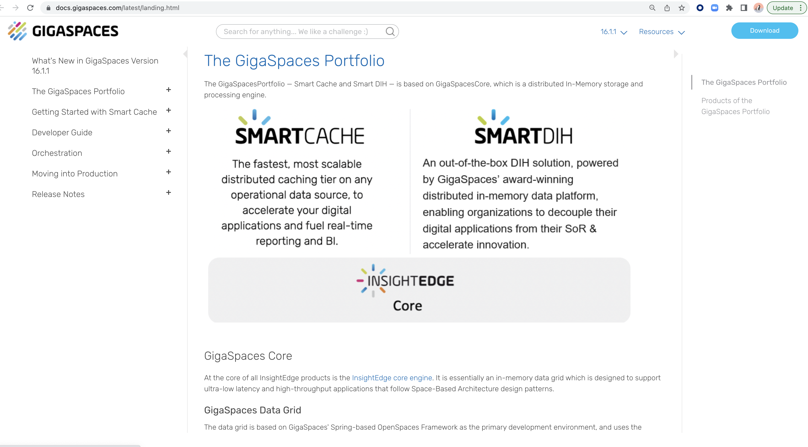

# gs-admin-training - lab01-gs_setup

## GigaSpaces setup and installation

#### 1 Setup

##### 1.1 Download and install GigaSpaces version 17.1.2:

1. Download GigaSpaces 17.1.2 from:

[Downloads](https://support2.gigaspaces.com/support/solutions/articles/60000661815-downloads)

2. Extract the zip file.

For additional information, please see our [Installation Guide](https://docs.gigaspaces.com/latest/landing-pages/installation-guide.html)

##### 1.2 Put `tryme` license in the `gs-license.txt` file located at the root of GigaSpaces installation directory.

##### 1.3 Go to `$GS_HOME/bin` open `setenv-overrides.sh` and set:  
   `JAVA_HOME` -> point to your java installation directory  
   `GS_LOOKUP_GROUPS` -> set to any unique identifier
   
##### 1.4 Test your GigaSpaces Installation.  
   You will start a GigaSpaces process (gs-agent) and you will wait to see a message that the gs-agent started successfully with groups [<your user group>]
   
    cd $GS_HOME/bin
    ./gs.sh host run-agent --auto --gsc=2
   
   The following screen will appear:
   (Search for the message marked below):
   

   
   If you see the above, you have successfully installed the courseware for our class.
   
##### 1.5	Stop processes
    Stop the gs-agent process (2 options):
    1. Ctrl+C
    2. ./gs.sh host kill-agent

#### 2	Wiki and API Doc Exercise  

##### 2.1 Validate internet connectivity by opening a browser and going to GigaSpaces site: 
        www.gigaspaces.com
##### 2.2 Click on Resources | Technical Documentation

        

     
