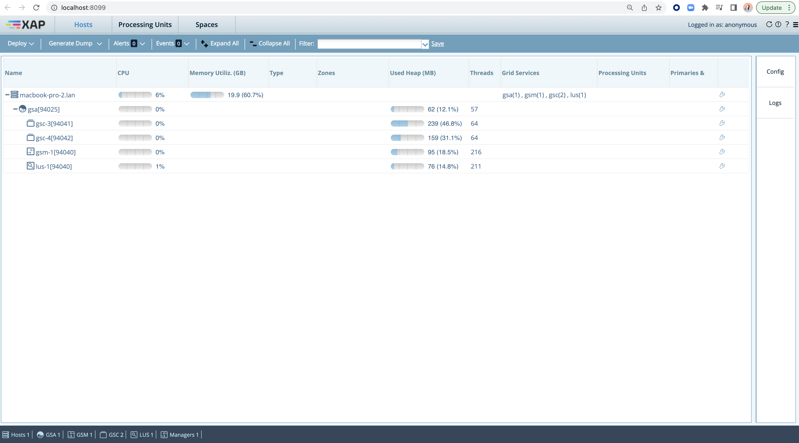
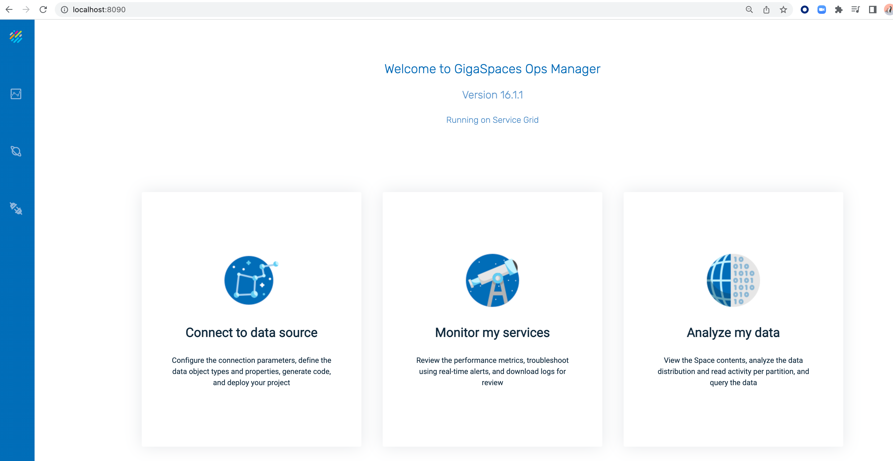

# gs-admin-training - lab02-gs_basic_overview

## 	GS Overview

###### Lab Goals
*   Be introduced to and experience Grid Service Components.

###### Lab Description
In this lab you will start GS infrastructure services and inspect the runtime grid, aka service grid, in the GS-UI.

## 1	Start GS Infrastructure

1. Goto `$GS_HOME/bin`
2. Run: `./gs.sh host run-agent --auto --gsc=2`
3. Start gs-ui using: `./gs-ui.sh`
    
## 2	Examine the running environment
    
1. Examine the ‘gigaspaces-manager.log’ Check the GSM and GSCs have started and registered successfully.  

2. Go to the gs-ui application.
3. Press the host tab.
4. Press on the gsc processes to see the process information and log.
    

5. Open your browser and go to `localhost:8099`
6. Examine the Webui console.
7. You will learn more about it at a later session.
    

8. Open your browser and go to `localhost:8090`
9. Examine GS Ops Manager.
10. You will learn more about it at a later session.

