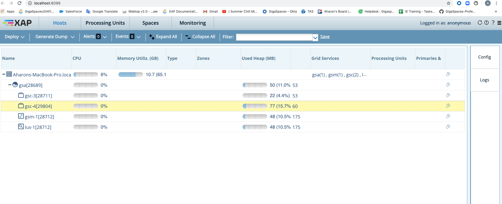
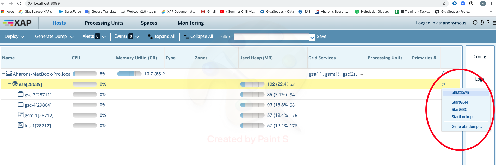

# gs-admin-training - lab03-grid_service_components

##    Grid Service Components

###### Lab Goals
*   Be introduced to and experience Grid Service Components.

###### Lab Description
In this lab you will start GS infrastructure services and inspect the runtime grid, aka service grid, in the GS-UI.

## 1	Start GS Infrastructure

1. Go to `$GS_HOME/bin`
2. Run: `./gs.sh host run-agent --auto --gsc=2`
    
## 2	Examine the running environment

1. Examine the `gigaspaces-manager.log`. Check the GSM and GSCs have started and registered successfully.  

2. Go to the web Management Console at `localhost:8099`
3. Click the 'Hosts' tab.
4. Click on the gsc processes to see the process information and log.

## 3	Self-Healing

In this exercise you will be introduced to the self-healing capabilities of the In-Memory Data Grid. 
We will kill (using task manager or kill -9) a GSC process and see that it restarts automatically by the gs-agent and that new partition are created accordingly.  

1. Kill a GSC

Each process ID (all are JVMS) are shown at the Hosts tab (see red circle below). 
Choose 1 of the GSCs PID and use the Task Manager or kill command in order to kill the process. 
If the PID is not shown in the Task Manager, choose "view -> select columns" and add the PID column. 
For Linux use: `kill -9 <PID>`

2. Return to the web Management Console in order to check the recovery status.

3. The following is the Self-Healing processes.  GSC was re-launched by gs-agent.
    
 

4. Stop the runtime grid.

* Press on the GSA.
* Click to open GSA actions.
* Select shutdown
    
 

