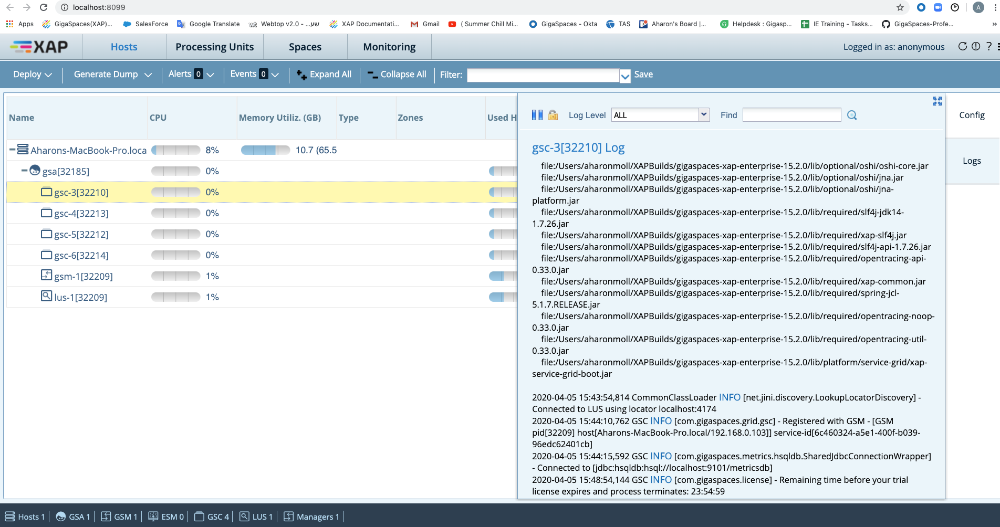
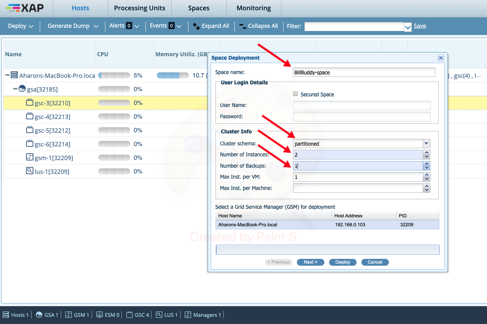
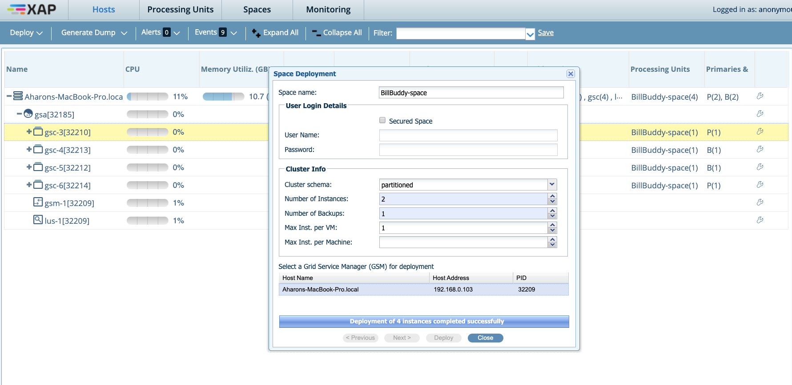
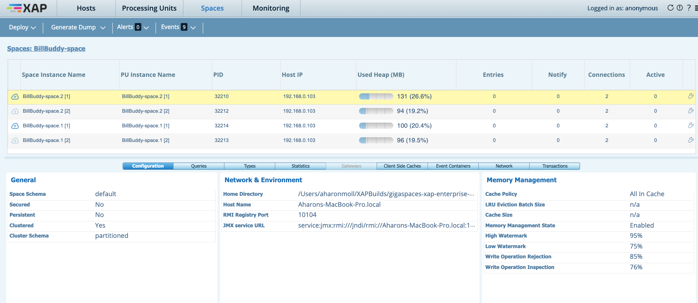
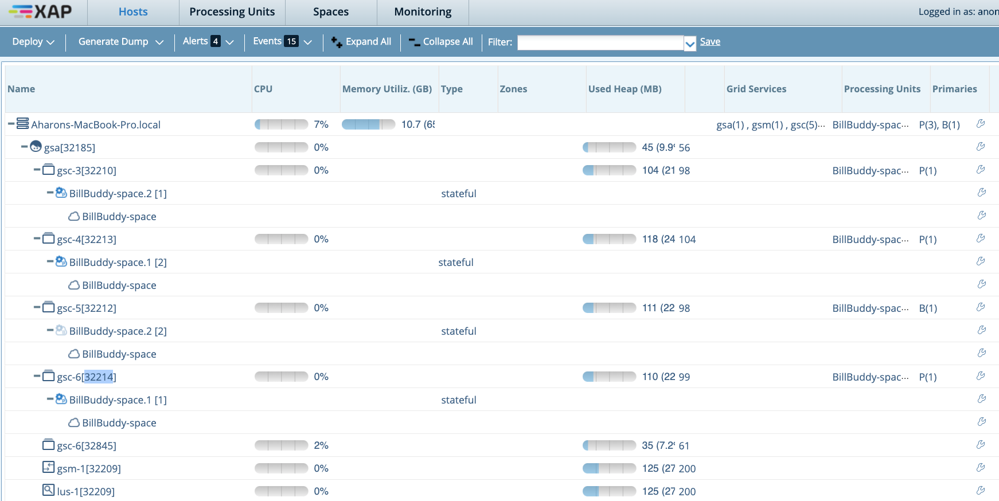
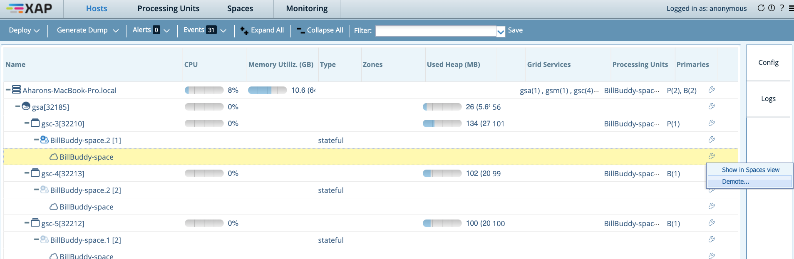
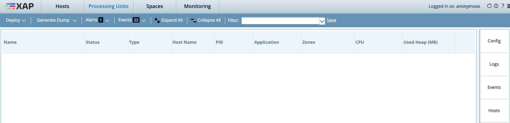

# gs-admin-training - lab04-application_components

## 	Application Level Components

###### Lab Goals 
 * Be introduced to and experience application level components.
 * Deploy, test and un-deploy applications (such as In-Memory Data Grid).
 * Experience the self-healing capability of the space.

###### Lab Description
In this lab you will start GS infrastructure services, deploy a Space, perform some benchmarks using a benchmark tool that will test your space, and undeploy the space. You will perform most actions using GigaSpaces Web Management Console service (a.k.a. gs-webui). You will also try to check the self-healing capabilities of the space by stopping a GSC and see how GS heals itself.

## 1	Start XAP Infrastructure

1. Go to `$GS_HOME/bin`
2. Run: `./gs.sh host run-agent --auto --gsc=4`
3. Go to the web Management Console `localhost:8099`
4. Press on the gsc processes to see the process information and log.

## 2	Deploy an In Memory Data Grid
1. Use the “Deploy an In Memory Data Grid” option in the menu (see top left red arrow in the diagram below).
 
2. A Deployment Wizard screen will open.

3. Fill in the fields as follows (see red arrows for locations).

4. Press the Deploy button. The following should be the status of the deployment wizard after all deployments are done:

5. Press the close button.

6. Examine the “Processing Units” tab.

 * Identify the primary and backup partitions.

7. Examine the "Spaces" tab

Hint: use the table in the Service View Tab.

8. Examine which space instance is located on which GSC?

## 3	Test your In Memory Data Grid
We will now examine several operations that allow you to test, monitor and examine objects that are stored in the space. The tools that we will use are: Benchmark, Statistics and Query, located in the circle at the snapshot below.

1. Run `$GS_HOME/gs-ui.sh`. Press on the Benchmark tool.

The benchmark tool allows you to perform operations against the space. You can monitor the space performance using the statistics operation.

2. Perform a write and read 10,000 POJOs. 
(Simply press start but examine the tool input data prior to activating it).

3. While the benchmark is executing go to the statistics operation and check the statistics.

4. Perform more benchmarks and view the result in the statistics page. For example perform a read. Your statistics view might look something like this:

5. Go to the Query operation and press on the execute button (red arrow).
What you see is the list of Space Object types (Classes) that are currently stored in the space.

In later lessons we will use this view to query the objects

Go to the Data_Types operation select the MessagePOJO data type and press query.

6. Examine the objects written to space.

7. Perform the above steps (3 to 6) also using gs-webui.

## 4	Self-Healing

In this exercise you will be introduced to the self-healing capabilities of the In-Memory Data Grid.
Basically we will ‘kill’ (using Windows Task Manager or kill -9) a GSC process and see that it restarts automatically by the gs-agent and that new partition are created accordingly.

1. Each process ID (all are JVMs) is shown at the Hosts tab (see red circle). Choose 1 of the GSCs PID (with primary space instance on it) and use the Task Manager or (kill -9 for Linux) in order to kill the process.
 
If the PID is not shown in the Task Manager simply choose "View -> Select Columns" and add the PID column.

2. Return to the gs-webui in order to check the recovery status.

3. The following is a summary of the self-healing process.

 * A backup was promoted to Primary.
 * GSC was re-launched by the gs-agent.
 * A new backup partition was provisioned.

4. Recovery is performed, the backup partition is now a primary.

5. Restart a primary partition by selecting the primary partition and right click -> Restart BillBudy-space.1 [2]. What happens?

6. In general, if you need to change a primary space to a backup it is better to use the demote command:

    
## 5	Un-deploy a Data Grid

1. Click on 'Deployed Processing Units' tab.

2. Right click on space and click on 'Undeploy'.

3. The following screen should appear:

4. You have un-deployed the space successfully!

