# gs-admin-training - lab06-ops_manager

# GigaSpaces Ops Manager 

## Lab Goals

1. Explore from close GS Ops Manager windows.
2. Get familiar with GS Ops Manager capabilities.

## Lab Description
In this lab we will focus on GigaSpaces Ops Manager functionalities.  
To better know its capabilities you will use GS Ops manager ui demo tool for your convenience.

### 1 Download and run GS Ops manager demo tool:

 * `git clone https://github.com/GigaSpaces-ProfessionalServices/ui-demo`
 * Open README.MD and follow its instructions:  `
   https://github.com/GigaSpaces-ProfessionalServices/ui-demo/blob/master/README.MD`
 * Once done with the above README, continue with the next section **(2 UI DEMO)** 
       
### 2 UI DEMO

Open the ui demo:
 * http://localhost:8280/

#### 2.1 CPU Alert:
 * Choose ProductsCatalog Service and trigger the CPU Alert:
  

 * Troubleshoot it in the GS Ops Manager:
  
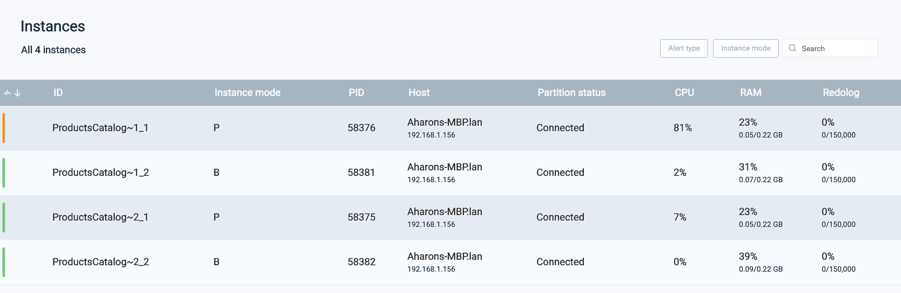

#### 2.2 Memory Alert:
 * Choose ProductsCatalog Service and trigger the Memory Alert:
  

 * Troubleshoot it in the GS Ops Manager:

#### 2.3 Unavailability Alert:
 * Choose Mirror Service and trigger the Unavailability Alert:
  
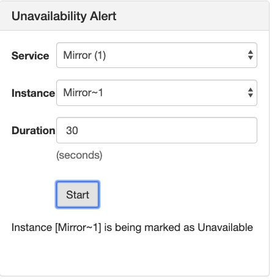
 * Troubleshoot it in the GS Ops Manager:
  
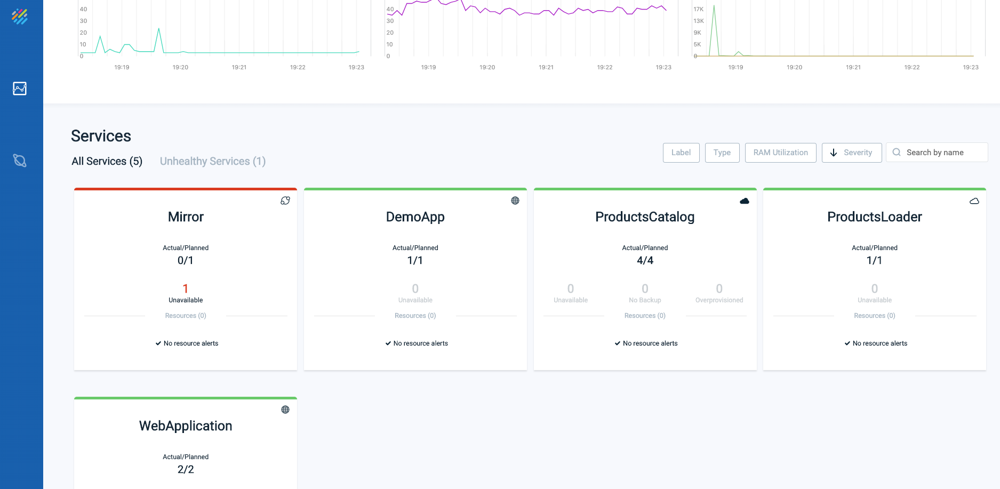

#### 2.4 No-Backups Alert:
 * Choose ProductsCatalog Service and trigger the No-Backups Alert:
  
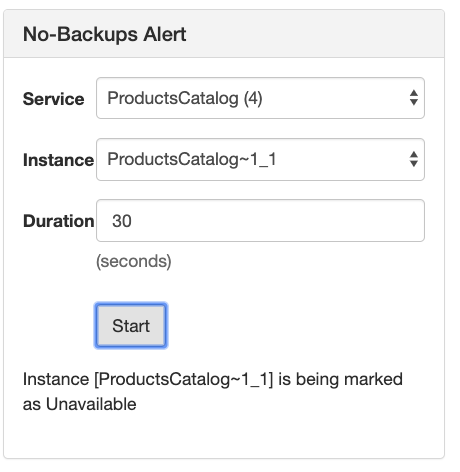
 * Troubleshoot it in the GS Ops Manager:

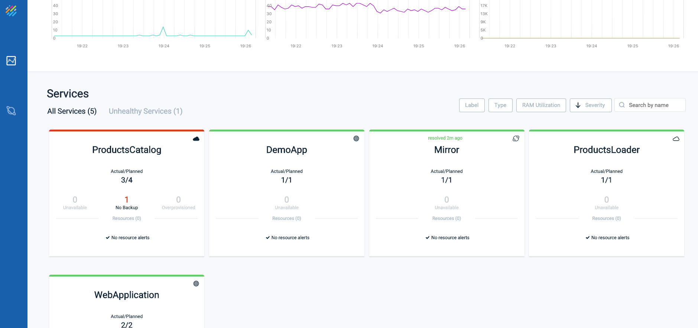

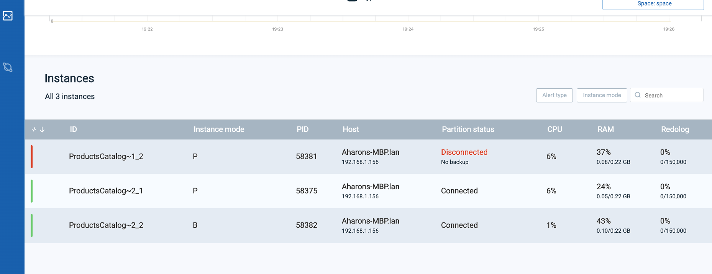

#### 2.5 Create Containers:
 * Select your host and click the 'Create' button:
  
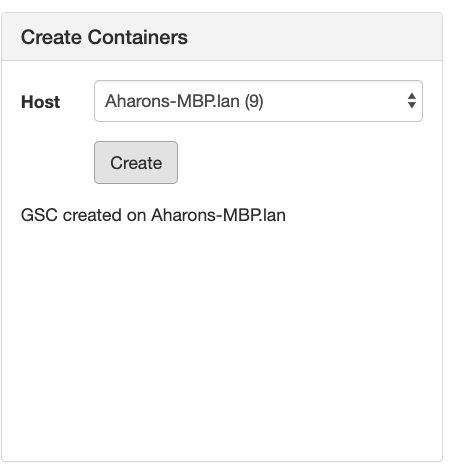
 * Verify that you have a free GSC in the Web Management Console:
  
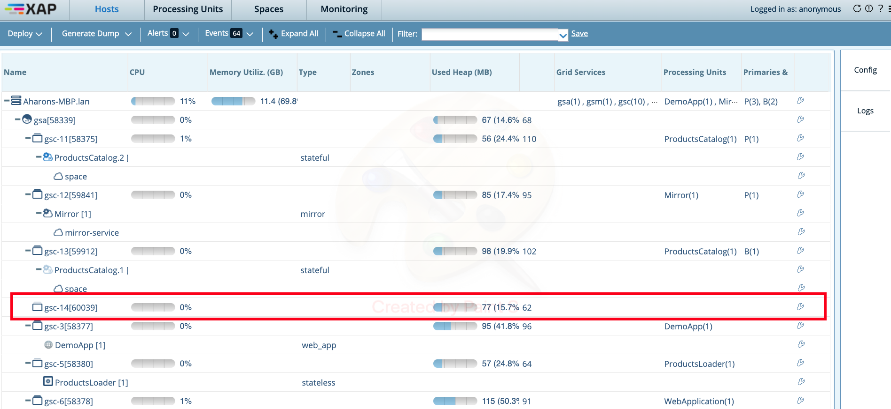

#### 2.6 Scale Up Service:
 * Choose WebApplication Service and click the Scale up button:
  
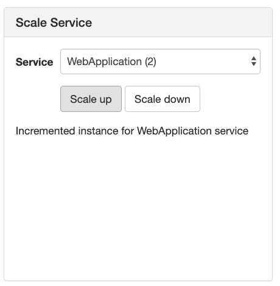
 * Verify WebAppliaction instance was incremented in the GS Ops Manager Services view:
  

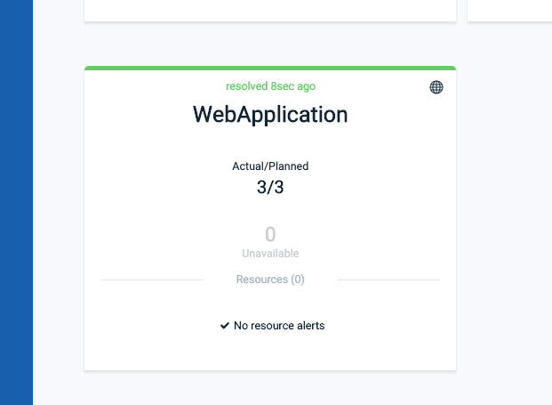

#### 2.7 Scale Down Service:
 * Choose WebApplication Service and click the Scale down button:

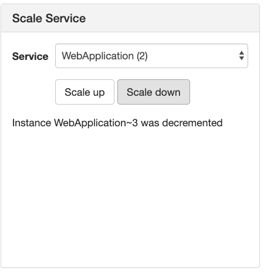
 * Verify WebAppliaction instance was decremented in the GS Ops Manager Services view:

#### 2.8 Remove Containers:
 * Open the Web Management Console and verify which GSC pid is empty with no service is deployed on it:

 * Select your host and Container to remove click the Remove button:

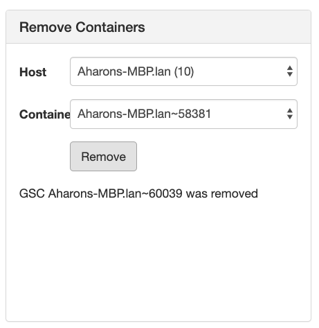
 * Verify in the Web Management Console spare GSC was removed:

### 3 UI DEMO termination

From ui-demo folder run:  
 * `./undeploy_all.sh`

 * Shutdown the GS run time environment and roll back setenv-overrides.sh (delete or comment GS_GSC_OPTIONS line).

