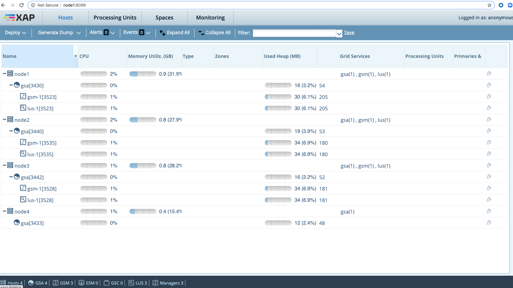

# gs-admin-training - lab08-gigaspaces_manager

# GigaSpaces manager 

## Lab Goals

1. See how easy it is to setup a GigaSpaces cluster.
2. Get familiar with GS Manager's capabilities.

## Lab Description
In this lab we will focus on the GS Manager functionality.  
To better know its capabilities you will set up 4 machine cluster based on Vagrant.

### 1 Setup Vagrant framework on your machine

#### Install VirtualBox

https://www.virtualbox.org/wiki/Downloads

#### Install Vagrant

https://www.vagrantup.com/downloads.html

### 2 "vagrant up" and provisioning your virtual machine

1. `cd ~/gs-admin-training/lab08-gigaspaces_manager/Vagrant`
2. `vagrant up`
3. Wait until all 4 virtual machines are booted and ready.

See in the following screenshot node3 is done (booted and ready) and immediately after node2 has started to boot...  


**Note:** For more information on "How to Set Up a Local Linux Environment with Vagrant":  
`https://medium.com/@JohnFoderaro/how-to-set-up-a-local-linux-environment-with-vagrant-163f0ba4da77`


### 3 Explore the cluster

Please enter the Web Management Console (web-ui).  
It should be available on all manager machines: node1, node2 and node3.  
On node4 you shouldn't be able to use Web Management Console (web-ui) as it is a machine without GS Manager.

If you see the following, lab has been completed successfully by you :-)



**Tip:**  
To login to the machines goto the Vagrant directory and run:<br>
    `vagrant ssh node1` (e.g. login to node1)

### 4 Explore Apache ZooKeeper under the hood (optional section if time permits)

 * `git clone https://github.com/DeemOpen/zkui.git`
 * Follow the **Setup** instructions as appear in the readme:  
   https://github.com/DeemOpen/zkui/blob/master/README.md
 * Explore GS ZK tree to better understand GigaSpaces and the information stored in ZK.

### 5 Note:

 * If you see the following error:

The IP address configured for the host-only network is not within the
allowed ranges. Please update the address used to be within the allowed
ranges and run the command again.

Continue with the recommendations mentioned.

Edit `/etc/vbox/networks.conf`, add the following:
```
      * 10.0.0.0/8 192.168.0.0/16
      * 2001::/64
```
 * To determine the ip address to access the ui:
```
vagrant ssh node1
ip address show
```
For example:
| Node | IP Address |
|------|------------|
| Node1 | http://10.211.55.101:8090/ |
| Node2 | http://10.211.55.102:8090/ |
| Node3 | http://10.211.55.103:8090/ |
| Node4 | 10.211.55.104 (No web-ui or GigaSpaces Manager running)|     
