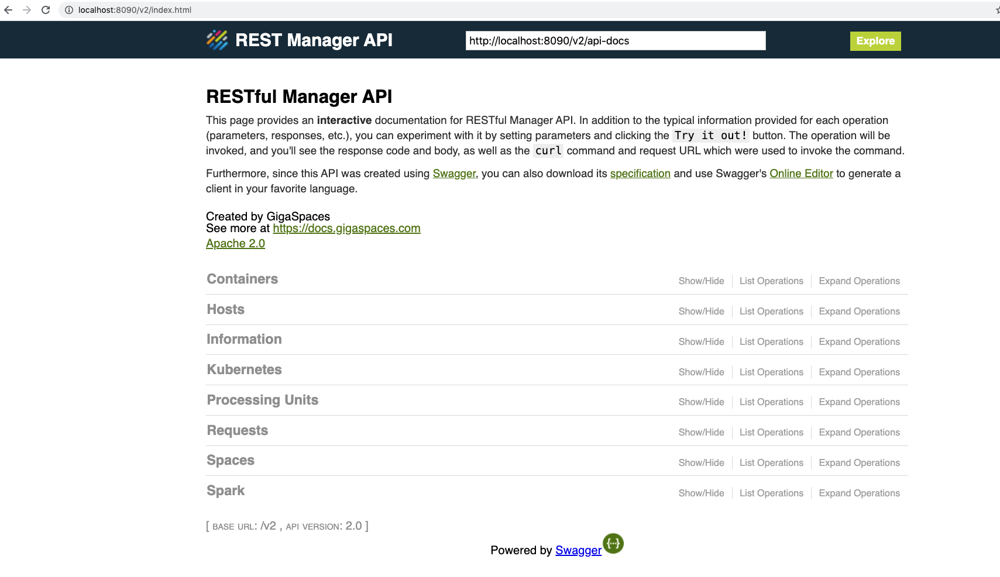

# xap-admin-training - lab9

# GigaSpaces Rest Manager API 

## Lab Goals

**1.** Explore from close GS Rest Manager API  
**2.** Get familiar with GS Rest Manager API capabilities 

## Lab Description
In this lab we will focus on GigaSpaces Rest Manager API. 
To better know its capabilities you will use GS Rest Manager API for your convenience.

### 1 Run XAP on your local machine

 * `cd $GS_HOME/bin` 
 * `./gs.sh host run-agent --auto` 
   
### 2 GS Rest Manager API

* Click on: 
http://localhost:8090/v2

### 3 Deploy the Bill Buddy Application

Please follow the steps you did in lab 5 but this time perform all steps (including raising the GSCs) by only using GS Manager API.  
The final result should be the same as in lab 5.

   