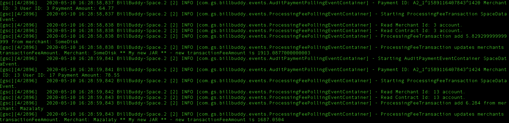

# gs-admin-training - lab10-hot_deploy

# Hot Deploy Procedure

## Lab Goals

Get experience with the hot deploy procedure using REST.  
Hot deploy can be used in the following cases: 
 
1. Changes in PU business logic.
2. Changes in data type schema.
3. Changes in GigaSpaces version.
4. Changes in host OS or Java version.

## Lab Description
In this lab we will focus on Hot Deploy when there is are changes in PU business logic.

We will:

 * Add the Custom Rest Upgrade Plugin.
 * Run the BillBuddy application. - as you did already in lab05.
 * Change the BillBuddy application logic.
 * Create a new JAR with this change.
 * Upload the new JAR.
 * Make the application to use the new jar without any downtime. 

### Add the Custom Rest Upgrade Plugin

#### 1  Clone the plugin
```
    $ git clone https://github.com/GigaSpaces-ProfessionalServices/CustomRestPlugins.git
    Cloning into 'CustomRestPlugins'...
    remote: Enumerating objects: 12, done.
    remote: Counting objects: 100% (12/12), done.
    remote: Compressing objects: 100% (7/7), done.
    remote: Total 12 (delta 1), reused 12 (delta 1), pack-reused 0
    Unpacking objects: 100% (12/12), 3.04 KiB | 389.00 KiB/s, done.
```    

#### 2  Build the project
```        
    $ cd CustomRestPlugins/
    $ mvn install
    [INFO] ------------------------------------------------------------------------
    [INFO] Reactor Summary for CustomRestPlugins 1.0-SNAPSHOT:
    [INFO] 
    [INFO] CustomRestPlugins .................................. SUCCESS [  0.180 s]
    [INFO] updatePlugin ....................................... SUCCESS [  0.963 s]
    [INFO] ------------------------------------------------------------------------
    [INFO] BUILD SUCCESS
    [INFO] ------------------------------------------------------------------------
    [INFO] Total time:  1.217 s
    [INFO] Finished at: 2020-04-21T18:33:28+03:00
    [INFO] ------------------------------------------------------------------------
```
#### 3  Copy updatePlugin/target/updatePlugin.jar to ${GS_HOME}/lib/platform/manager/plugins/
 
### Run the BillBuddy application.
The steps are the same as you have done in lab05.

#### 1	Start gs-agent

1. Navigate to `$GS_HOME/bin`
        
2. Start gs-agent with local Manager server and 4 GSCs:
   `./gs.sh host run-agent --auto --gsc=4`
    
#### 2	Deploy BillBuddy_Space.jar
    
1. Open `$GS_TRAINING_HOME/lab10-hot_deploy` project with Intellij (open pom.xml).
2. Run `mvn install`
```
   `~/gs-admin-training/lab10-hot_deploy$ mvn install`
    
    
    [INFO] Reactor Summary:
    [INFO] 
    [INFO] Lab10 ............................................... SUCCESS [  0.204 s]
    [INFO] BillBuddyModel ..................................... SUCCESS [  1.087 s]
    [INFO] BillBuddy_Space .................................... SUCCESS [  0.207 s]
    [INFO] BillBuddyAccountFeeder ............................. SUCCESS [  0.189 s]
    [INFO] BillBuddyCurrentProfitDistributedExecutor .......... SUCCESS [  0.225 s]
    [INFO] BillBuddyWebApplication ............................ SUCCESS [  0.349 s]
    [INFO] BillBuddyPaymentFeeder ............................. SUCCESS [  0.190 s]
    [INFO] ------------------------------------------------------------------------
    [INFO] BUILD SUCCESS
```

3. Open a new terminal and navigate to `$GS_HOME/bin/`
           
4. Use the gs CLI to deploy BillBuddy_Space.  
   `./gs.sh pu deploy BillBuddyPU ~/gs-admin-training/lab10-hot_deploy/BillBuddy_Space/target/BillBuddy_Space.jar`

#### 3	Run BillBuddyAccountFeeder from Intellij

1. Set IntelliJ path variables (under preferences).

###### Add GS_LOOKUP_GROUPS & GS_LOOKUP_LOCATORS
2. Copy the `~/gs-admin-training/lab10-hot_deploy/runConfigurations` directory into Intellij's .idea directory and restart Intellij.
```
  cd ~/gs-admin-training/lab10-hot_deploy
  cp -r runConfigurations .idea/
```

3. From Intellij run configuration select BillBuddyAccountFeeder and run it.

###### This application writes Users, Merchants and Contracts to the Space
 
4. Validate Users and Merchants were written to the space using the web Management Console (`localhost:8099`).  
   Go to: Spaces Tab -> Data Types.
 


5. Query the list of Users by executing the following SQL:  
   Note: Click the Data Type Name and the sql will be created for you:  
   `SELECT * FROM com.gs.billbuddy.model.User WHERE rownum<5000`
    
###### Note: Fully qualified class name is required.


#### 4	Run BillBuddyPaymentFeeder project
The BillBuddyPaymentFeeder application creates payments by randomly choosing a user, 
a merchant and an amount and performs the initial process of a payment.  
This includes deposit and withdrawal updates of each party’s balance appropriately. 
After the payment is initially processed it is written to the space for further processing.   
A new Payment is created every second.
 
1. Run the **BillBuddyPaymentFeeder** using Intellij: 
Use the same instructions as used for the BillBuddyAccountFeeder.
2. Validate Payments were written to the space.
   Click the Payment Data Type Name as you did in section 3.3
3. Go to the statistics operations and see that a payment is actually added every second.


## 6 Hot Deploy

### Change the BillBuddy application logic - we will just change a log message.

1. Open com/gs/billbuddy/events/ProcessingFeePollingEventContainer.java class with IntelliJ.
2. Verify that you see this line at the end of the class:
```
    log.info("ProcessingFeeTransaction updates merchants transactionFeeAmount. Merchant: " + merchant.getName() +
                        " new transactionFeeAmount is " + merchant.getFeeAmount());
```                        
3. Open the GSA console log (in the terminal window) and verify that you see this printing rolling for each Merchant.


4. Go to Intellij and make a change something in the log message. For example:
```
      log.info("ProcessingFeeTransaction updates merchants transactionFeeAmount. Merchant: " + merchant.getName() +
                            " ** My new JAR ** - new transactionFeeAmount is " + merchant.getFeeAmount());
```          
          
 ### 6.2 Create a new JAR 
         
1. Run mvn install.
```    
    ~/gs-admin-training/lab10-hot_deploy$ mvn install
    
    [INFO] ------------------------------------------------------------------------
    [INFO] Reactor Summary:
    [INFO] 
    [INFO] Lab10 .............................................. SUCCESS [  0.215 s]
    [INFO] BillBuddyModel ..................................... SUCCESS [  1.354 s]
    [INFO] BillBuddy_Space .................................... SUCCESS [  0.693 s]
    [INFO] BillBuddyAccountFeeder ............................. SUCCESS [  0.242 s]
    [INFO] BillBuddyCurrentProfitDistributedExecutor .......... SUCCESS [  0.172 s]
    [INFO] BillBuddyWebApplication ............................ SUCCESS [  0.400 s]
    [INFO] BillBuddyPaymentFeeder ............................. SUCCESS [  0.234 s]
    [INFO] ------------------------------------------------------------------------
    [INFO] BUILD SUCCESS
```
    
3. Rename the jar file.
```   
    cd ~/gs-admin-training/lab10-hot_deploy/BillBuddy_Space/target
    mv BillBuddy_Space.jar BillBuddy_Space_V2.jar
``` 			

### 6.3 Upload the new JAR

1. Open the REST Manager API and navigate to Processing Units.

   PUT /pus/resources (http://localhost:8090/v2/index.html#!/Processing_Units/put_pus_resources)
 
2. Click on "Choose File" button and select BillBuddy_Space_V2.jar.  
3. Click on "Try it out!" button and verify that the response code is 201.


4. Verify that the new jar has been successfully uploaded:


### 6.4 Update the PU code using the plugin

1. Run the following curl command:
```
        curl -X PUT --header 'Accept: application/json' 'http://localhost:8090/v2/update/updatePu?oldResource=BillBuddy_Space.jar&newResource=BillBuddy_Space_V2.jar'
```        
2. Verify that the return code is 0.
```
        echo $?
        0
```        
3. You should receive a successful message:


        
4. Verify that the new jar has been removed:


### 6.5 Use the new PU
1. Restart the Containers.  
First restart backup only after primary:  
Use the GS CLI. We will elaborate more on its capabilities on the next lesson and lab.


2. Go to the GSA console and verify the change in the log message.


