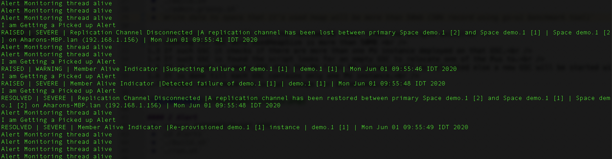

# xap-admin-training - lab12

# GigaSpaces Admin API 

## Lab Goals

**1.** Explore about the Admin API’s capabilities  
**2.** Learn to capture the alerts using the Admin APIs 

## Lab Description
In this lab we will focus on GigaSpaces Admin API. 
To better know its capabilities you will use GigaSpaces Admin API for your convenience.
In the lab we change default of service limit 1 in order to allow deployment of more than one instance in the same GSC
We run a feeder to fill up data, and run relocate in order to start a new GSC to allow more memory per each instance
We also run monitor script that show us various alerts related to CPU & memory utilization and instances

### 1	Start gs-agent

1.1 Navigate to $XAP_HOME/bin  
        
1.2 Start run the following:

    ./gs.sh host run-agent --auto
    ./gs.sh container create --vm-option -Dcom.gigaspaces.grid.gsc.serviceLimit=2 --memory 100m --count 2 localhost
    ./gs.sh space deploy --partitions 2 --ha demo

1.3 Edit gs-home/config/alerts/alerts.xml reduce memory(HeapMemoryUtilizationAlertConfiguration) and cpu(CpuUtilizationAlertConfiguration) thresholds 
1.4 Edit runFeeder, runMonitor, runRelocate scripts set installation home dir and lookupgroup.
1.5 See deployment distribution in web-ui (2 containers each having 2 instances)
1.6 Run the following scripts:
    build
    runMonitor
    runRelocate
    runFeeder
1.7 Follow console of the scripts, See deployment distribution in web-ui 
####  Relocate 
1.1 The Admin script will test the runtime 20 times (then the scripts exits) 
1.2 Looking for GSC were UsedHeapSize is more than 50MB  
1.3 If such GSC exits it checks if there are more than one PU instance deployed on that GSC. 
1.4 If such GSC is found the script looks for an empty GSC to relocate one of the Pu instances to. 
1.5 If it founds an empty GSC then  a PU instance will be relocated to that GSC else a new GSC will be started with AdminApiZone in zones & then the  PU instance will be relocated. 
1.6 The same repeated till each GSC contains only one PU instance. 
1.7 Between each check the script sleeps for 20 seconds. 
 
#### 2 Alert 
2.1 Terminate one of the GSC from the webui. 
2.2 Watch the alerts in the command console where you activated the script. 

