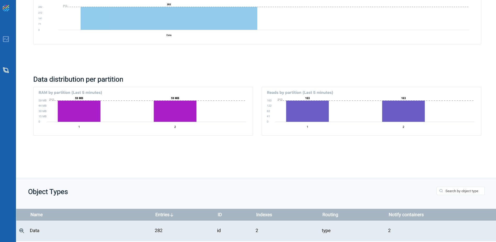
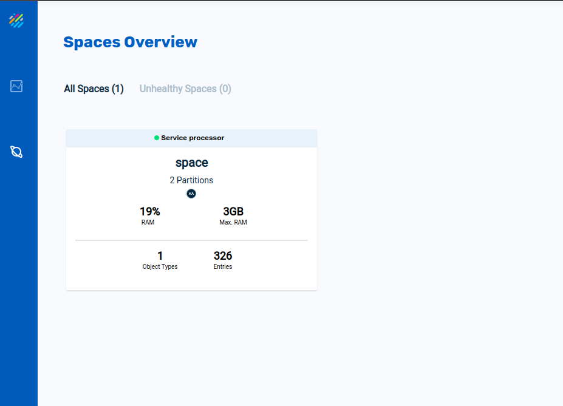

# gs-admin-training - lab14-kubernetes

# Kubernetes & Vertical scaling

## Lab Goals

Get experience with running a XAP PU on a Kubernetes cluster.  
Perform scale of a stateful pu.

## Lab Description
In this lab we will deploy xap-manager, xap-operator, a stateful processor pu and a stateless feeder.  
We will perform scaling of the processor pu.

## Prerequisites
Before beginning to work with the data grid and xap, ensure that you have the following installed on your local machine or VM:

 * [kubectl](https://kubernetes.io/docs/tasks/tools/install-kubectl/)

 * [helm](https://docs.helm.sh/using_helm/#quickstart-guide)  
   Important: Previous versions of this lab supported Helm 2 only. As of XAP 15.5, Helm 3 is supported in XAP 15.5 release.  
   This lab has been updated to support Helm 3.
 * [minikube](https://kubernetes.io/docs/setup/minikube/)
 * [docker engine](https://docs.docker.com/engine/install/)

### minikube Setup ###
1. Configure memory and cpu:

```
    minikube config set memory 4096
    minikube config set cpus 4
```
    
2. After installation, configure the VM driver

   Note: If you installed VirtualBox as the Hypervisor run the following. This step is optional as minikube now prefers to use Docker as the VM driver.

   `minikube config set vm-driver virtualbox`

3. Start Minikube:  
   `minikube start`
```    
    😄  minikube v1.17.1 on Ubuntu 18.04
        ▪ KUBECONFIG=/home/dixson/kubeconfig
    ✨  Automatically selected the docker driver. Other choices: virtualbox, ssh, none
    👍  Starting control plane node minikube in cluster minikube
    🚜  Pulling base image ...
    💾  Downloading Kubernetes v1.20.2 preload ...
        > preloaded-images-k8s-v8-v1....: 491.22 MiB / 491.22 MiB  100.00% 4.38 MiB
    🔥  Creating docker container (CPUs=4, Memory=4096MB) ...
    🐳  Preparing Kubernetes v1.20.2 on Docker 20.10.2 ...
        ▪ Generating certificates and keys ...
        ▪ Booting up control plane ...
        ▪ Configuring RBAC rules ...
    🔎  Verifying Kubernetes components...
    🌟  Enabled addons: storage-provisioner, default-storageclass
    🏄  Done! kubectl is now configured to use "minikube" cluster and "default" namespace by default
```

4. In a separate terminal expose the minikube load balancer:  
   `minikube tunnel`


### Application Deployment
####  helm repo setup 
1. Add GigaSpaces helm repository to the repository list

    `helm repo add gigaspaces https://resources.gigaspaces.com/helm-charts`

2. Fetch the GigaSpaces Helm charts from the GigaSpaces repository

    The charts are unpacked in your current directory. This step is optional.
    
    ```
    helm pull gigaspaces/dih    --version 17.1.2 --untar
    helm pull gigaspaces/xap-pu --version 17.1.2 --untar
    ```

#### Manager and Operator deployment   
1. Deploy a **xap-manager** pod called manager:  
   `helm install manager gigaspaces/xap-manager --version 17.1.2`

2. Deploy the xap-operator and name it operator. The xap-operator is responsible for deployment of PUs and managing the **pu** Custom Resource Definition:  
   `helm install operator gigaspaces/xap-operator --version 17.1.2 --set manager.name=manager`

##### View and monitor kubernetes deployment
3. Verify that the pod is running
    ```
    kubectl get pods
    NAME                        READY   STATUS    RESTARTS   AGE
    manager-xap-manager-0           1/1     Running   0          26m
    xap-operator-5566dd4587-4kwcq   1/1     Running   0          25m
    ```
    
4. In a separate terminal open the Minikube Dashboard. The browser will automatically open.

    `minikube dashboard &`


5. Open Gigaspaces Ops Manager
    Get the manager ip by running `kubectl get services`, the manager ip will be the __EXTERNAL-IP__, in this case 10.108.7.199

    ```
    kubectl get services
    NAME                              TYPE           CLUSTER-IP     EXTERNAL-IP    PORT(S)                                        AGE
    kubernetes                        ClusterIP      10.96.0.1      <none>         443/TCP                                        4m17s
    manager-xap-manager-hs            ClusterIP      None           <none>         2181/TCP,2888/TCP,3888/TCP,4174/TCP            19s
    manager-xap-manager-service       LoadBalancer   10.108.7.199   10.108.7.199   8090:32221/TCP,4174:31234/TCP,8200:31837/TCP   19s
    ```

    Open Gigaspaces Ops Manager by browsing to `<EXTERNAL-IP>:8090`


#### Processor and Feeder Service deployment
##### Generate the process and feeder jars and upload them
    
1. `cd $GS_HOME/examples/data-app/event-processing`
2. `./build.sh package`
3. `$GS_HOME/bin/gs.sh --server 10.108.7.199`

    (Starts an interactive session)

4. `pu upload $GS_HOME/examples/data-app/event-processing/processor/target/data-processor.jar`  
   **The result should be:**  
   [data-processor.jar] successfully uploaded
   Resource URL: http://10.108.7.199:8090/v2/resources/data-processor.jar
5. `pu upload $GS_HOME/examples/data-app/event-processing/feeder/target/data-feeder.jar`  
   **The result should be:**  
   [data-feeder.jar] successfully uploaded
   Resource URL: http://10.108.7.199:8090/v2/resources/data-feeder.jar

##### Deploy the Processor Service
```   
helm install processor gigaspaces/xap-pu --version 17.1.2 --set manager.name=manager,partitions=2,readinessProbe.enabled=true,resourceUrl=http://10.108.7.199:8090/v2/resources/data-processor.jar
```

```
    kubectl get pod
    NAME                        READY   STATUS    RESTARTS   AGE
    processor-xap-pu-0              1/1     Running   0          19m
    processor-xap-pu-1              1/1     Running   0          19m
    processor-xap-pu-2              1/1     Running   0          19m
    processor-xap-pu-3              1/1     Running   0          18m
    manager-xap-manager-0           1/1     Running   0          28m
    xap-operator-5566dd4587-4kwcq   1/1     Running   0          26m
```
    
##### Deploy the feeder service
```
helm install feeder gigaspaces/xap-pu --version 17.1.2 --set manager.name=manager,resourceUrl=http://10.108.7.199:8090/v2/resources/data-feeder.jar
```
```
    kubectl get pod
    NAME                        READY   STATUS    RESTARTS   AGE
    feeder-xap-pu-0                 1/1     Running   0          17m
    processor-xap-pu-0              1/1     Running   0          20m
    processor-xap-pu-1              1/1     Running   0          20m
    processor-xap-pu-2              1/1     Running   0          20m
    processor-xap-pu-3              1/1     Running   0          20m
    manager-xap-manager-0           1/1     Running   0          29m
    xap-operator-5566dd4587-4kwcq   1/1     Running   0          27m
    
    kubectl get pus
    NAME        STATUS
    feeder      DEPLOYED
    processor   DEPLOYED
```

##### View and monitor GS kubernetes deployment

1. minikube dashboard


2. GS Ops Manager

Click on "Monitor my services"  


Click on "Space"  



Query the data:  


### Scaling GigaSpaces Applications
#### Perform memory scaling using Kubernetes tools

1. Review current RAM occupied by the processor service.

   Click on the processor service  

   

2. Edit the current processor service's memory configuration using the minikube dashboard. Click on the processor service's StatefulSet, click on the edit (pencil icon) in the top right corner:<br/>

   

3. Click on Space overview:  

   

#### Perform memory scale using the GS CLI

1. Scale the processor service

    `$GS_HOME/bin/gs.sh --server 10.108.7.199 pu scale-vertical --memory=600Mi processor`


   **The result should be:**  
   Request ID     1

   Status can be tracked using the command: request status 1

   `request status 1`  

   **The result should be:**  
   REQUEST DETAILS    
   ID                 1                                                      
   Description        Patch request for StatefulSet: [processor-xap-pu-2]    
   Status             running                                                
   Submitted By       anonymous                                              
   Submitted From     192.168.99.1                                           
   Submitted At       2020-07-08 09:52:23

   **Finally the result should be:**  
   `request status 1`  

   REQUEST DETAILS    
   ID                 1                                                      
   Description        Patch request for StatefulSet: [processor-xap-pu-2]    
   Status             successful                                             
   Submitted By       anonymous                                              
   Submitted From     192.168.99.1                                           
   Submitted At       2020-07-08 09:52:23                                    
   Completed At       2020-07-08 09:54:28

3. Partition 2's memory should have increased:  
   The GS Ops manager service view is below:  

   

   The minikube dashboard pods view is below:
   


### Cleanup
##### Undeploy the services
```
    helm del feeder
    helm del processor
    helm del operator
    helm del manager
```
##### Delete and stop the minikube
    minikube delete
  
  
