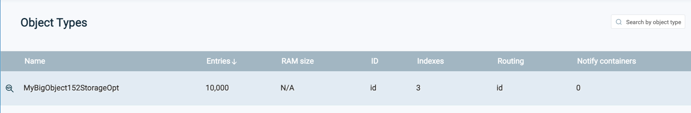
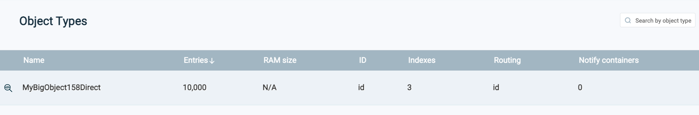
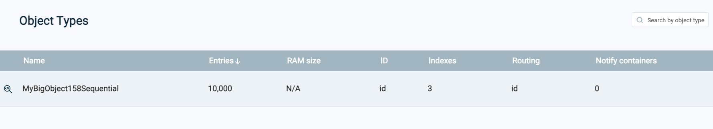
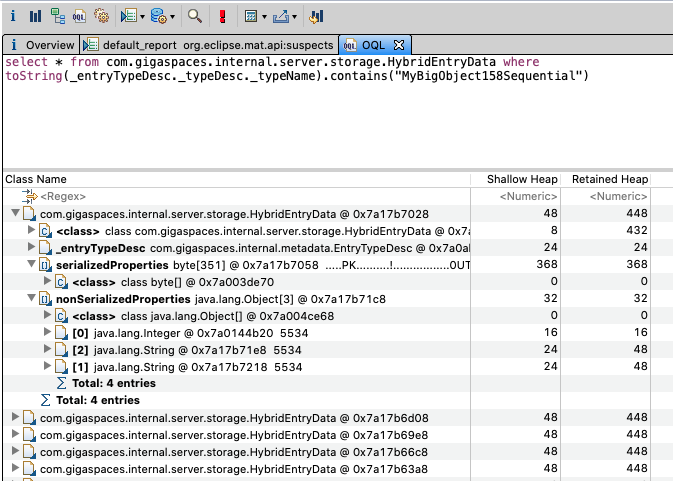

# gs-admin-training - lab15-storage_optimization

# Storage Optimization

## Lab Goals

The storage optimization feature can be used to help conserve RAM. This lab will introduce the basic concepts behind the storage optimization feature.

## Lab Description
In this lab we will need to write 4 types of Space Objects. Each type will use a different Storage Optimization.

You will write each Space Object separately to the space and use Memory Analyzer (MAT) to measure its heap size.

### Lab Exercise
#### Requirements:
###### 1. Create 4 different objects according to the following requirements:

 * Space Id - Integer
 * Order Index key - String *will be filled with 1 char*
 * Equal and Order key - String *will be filled with 1 char*
 * Ten properties - String *will be filled with 5 chars*
 * Payload - String array *will be filled with 150 chars*

###### 2. Annotate the 4 Objects as follows:

 * The first will not have any optimization.
 * The second will use the Storage Types that has been introduced in version 15.2. See: https://docs.gigaspaces.com/latest/dev-java/storage-types-controlling-serialization.html?Highlight=storage%20adapters
* The third will use the new Direct Storage Optimization that has been introduced in version 15.8. See: https://docs.gigaspaces.com/latest/dev-java/storage-optimization.html?Highlight=Storage%20optimization
* The fourth will use the new Sequential Storage Optimization that has been introduced in version 15.8. Same page as above. 

###### 3. Start the Grid
`./gs.sh host run-agent --manager --gsc=1`
    
###### 4. Deploy "demo" space with 1 partition (no backup)
    
###### 5. Write the first type to the space

 * Fill the first type with data.
 * Write 10K instances to the space.
 * Open the Ops Manager and verify that you see the entries. 

###### 6. Take a heap dump
 * Open the Ops Manager and take the heap dump of the space.
 * Un-deploy "demo" space 

###### 7. Analyze the heap dump
 * Launch the Memory Analyzer (MAT) and open the heap dump you have just created.
 * Verify its size.
 * Open the OQL tab and run the following query for MyBigObjectNoStorageOpt:
```
select * from com.gigaspaces.internal.server.storage.FlatEntryData where toString(_entryTypeDesc._typeDesc._typeName).contains("MyBigObjectNoStorageOpt")
``` 
###### 8. Repeat steps 4-7 for each type
 * Run the following query for MyBigObject152StorageOpt:  
```
select * from com.gigaspaces.internal.server.storage.FlatEntryData where toString(_entryTypeDesc._typeDesc._typeName).contains("MyBigObject152StorageOpt")
```
 * Run the following query for MyBigObject158Direct:  
```
select * from com.gigaspaces.internal.server.storage.HybridEntryData where toString(_entryTypeDesc._typeDesc._typeName).contains("MyBigObject158Direct")
```
 * Run the following query for MyBigObject158Sequential:  
```
select * from com.gigaspaces.internal.server.storage.HybridEntryData where toString(_entryTypeDesc._typeDesc._typeName).contains("MyBigObject158Sequential")
```

#### Solution

### MyBigObjectNoStorageOpt - Footprint per Object 1,352 byte / Total Heap size = 36.3


<br/>
<br/>
<br/>
<br/>

### MyBigObject152StorageOpt - Footprint per Object 936 byte / Total Heap size = 26.9



<br/>
<br/>
<br/>
<br/>

### MyBigObject158Direct - Footprint per Object 472 byte / Total Heap size = 27



 * In the new HybridEntryData class it is nice to see the division between the serialized and the non-serialized properties.
 * The new Storage Optimization feature reduced the Space Object by ~60%


<br/>
<br/>
<br/>
<br/>

### MyBigObject158Sequential - Footprint per Object 448 byte / Total Heap size = 23


  * In the new HybridEntryData class it is nice to see the division between the serialized and the non-serialized properties.
  * The new Storage Optimization feature reduced the Space Object by ~60%


<br/>
<br/>
<br/>
<br/>


