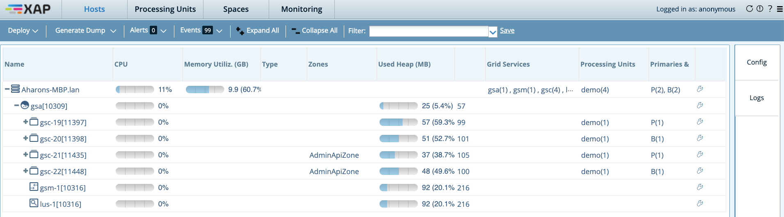

# xap-admin-training - lab12

# GigaSpaces Admin API 

## Lab Goals

**1.** Explore about the Admin API’s capabilities  
**2.** Learn to capture the alerts using the Admin APIs 

## Lab Description
In this lab we will focus on GigaSpaces Admin API. 
To better know its capabilities you will use GigaSpaces Admin API for your convenience.

### 1	Start gs-agent

1.1 Navigate to $XAP_HOME/bin  
        
1.2 Start run the following:

    ./gs.sh host run-agent --auto
    ./gs.sh container create --vm-option -Dcom.gigaspaces.grid.gsc.serviceLimit=2 --memory 100m --count 2 localhost
    ./gs.sh space deploy --partitions 2 --ha demo
    
#### 1 Relocate
 * `export XAPHOMEDIR=$XAP_HOME` 
 * `cd Relocate` 
 * `./build.sh`  
 * `./admin.groovy.sh` 
 * `Write data to space that it's used heap will be more than 50mb (50k record using gs-ui benchmark tool)`

1.1 The Admin script will test the runtime 20 times (then the scripts exits) 
1.2 Looking for GSC were UsedHeapSize is more than 50MB  
1.3 If such GSC it checks if there are more than one PU instance deployed on that GSC. 
1.4 If such GSC is found the script looks for an empty GSC to relocate one of the Pus to. 
1.5 If it founds an empty GSC then the PU first PU instance will be relocated else a new GSC will be started with AdminApiZone in zones & then the first PU instance will be relocated. 
1.6 It is done till each GSC contains only one PU instance. 
1.7 Between each check the script sleeps for 20 seconds. 

   
#### 2 Alert
 * `export XAPHOMEDIR=XAP_HOME` 
 * `cd Alerts` 
 * `./build.sh`  
 * `./run.sh` 

2.1 Terminate one of the GSC from the webui. 
2.2 Watch the alerts in the command console where you activated the groovy script. 

