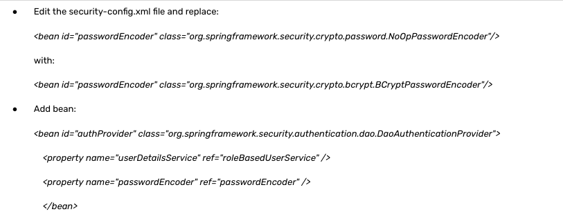
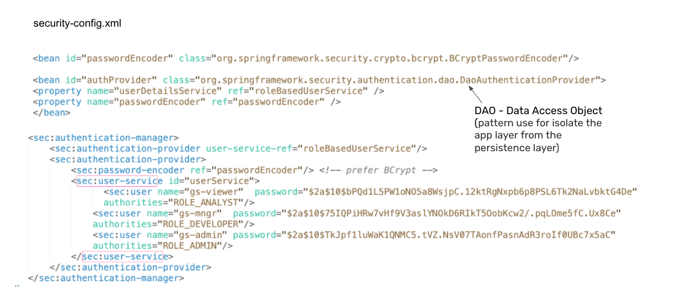
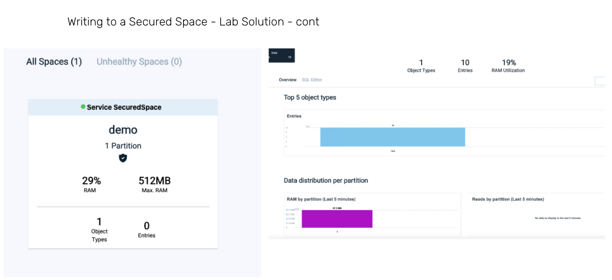

# xap-admin-training - lab13 - new

# Grid & Data Security

## Lab Goals

1. User Password Encryption  
2. Write to a secured Space which deployed to a secured Grid  

## Lab Description
In this lab we will focus on secured Grid/Space deployment. 
Authority and Authorization using XAP security management. 
Work with users with different roles. 

### User password encryption - Lab Exercise 1
#### Requirements:  
1. Edit the security-config.xml file  
2. encrypt and write the passwords for “gs-admin”, “gs-mngr” and “gs-viewer”   
3. use org.springframework.security.crypto.bcrypt.BCryptPasswordEncoder  
4. Verify that you can login through the Ops Manager 

#### Solution

### Writing to a Secured Space - Lab Exercise 2
#### Requirements:  
1. Write a PU contains:  
    a) a secured embedded space configured in the pu.xml (use plain text for the user/password)  
    b) a Spring Bean for the Feeder  
       the Feeder will have 2 methods:  
            public GigaSpace gigaSpaceProxy() - for connecting to the secured space  
            public void afterPropertiesSet() - for writing data  
    

#### Questions  
1. What user will you use?  
2. What privileges this user should have?

#### Solution

##### 1. Edit the security-config.xml file and add SPACE_WRITE to user gs-admin

##### 2. Start the grid

        ./gs.sh host run-agent --manager
        
        
        
##### 3. Deploy the PU with the embedded space

        ./gs.sh --username gs-admin --password gs-admin pu deploy SecuredSpace ../SecuredSpace/target/SecuredSpace-1.0-SNAPSHOT.jar

##### 4. Verify that the Feeder has been succeeded to connect to the secured space and write the data

