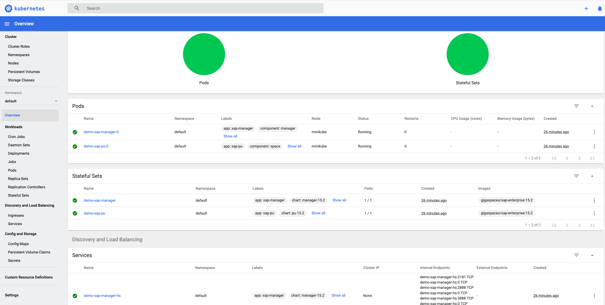
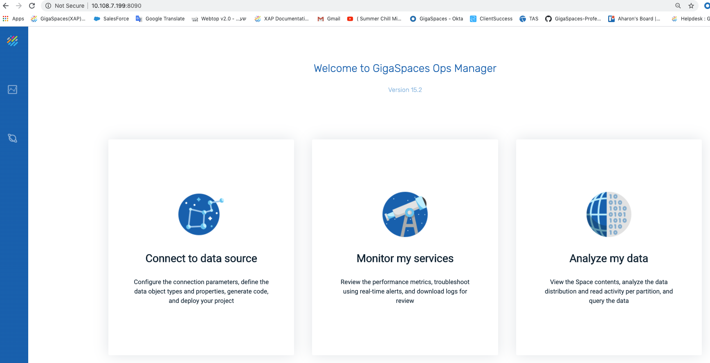
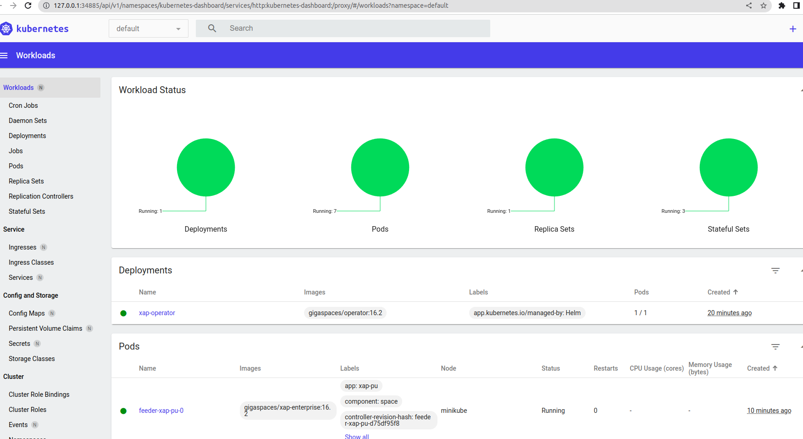
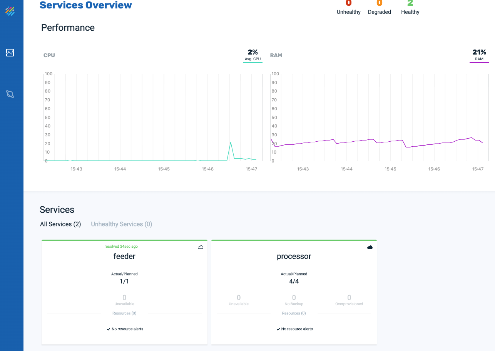

# xap-admin-training - lab14

# Kubernetes

## Lab Goals

Get experience with running XAP PU on Kubernetes cluster.   

## Lab Description
In this lab we will deploy the pre define xap demo application   
and then 
build and deploy BillBuddy application as DATA POD.  

## Prerequisites
Before beginning to work with the data grid and xap, 
ensure that you have the following installed on your local machine or a VM:  

[kubectl](https://kubernetes.io/docs/tasks/tools/install-kubectl/)

[Helm](https://docs.helm.sh/using_helm/#quickstart-guide)  
Important: You must use Helm 2 with KubeGrid. 
Helm 3 contains a new chart version, which is a breaking change and is not currently supported by KubeGrid.
Helm 3 will be supported in XAP 15.5 release

[minikube](https://kubernetes.io/docs/setup/minikube/)  
##### 1. Configure memory and cpu:

    minikube config set memory 4096
    minikube config set cpus 2
    
##### 2. After installation, configure the VM driver 
(for example: in case you installed VirtualBox as the Hypervisor run the following):

    minikube config set vm-driver virtualbox
    
##### 3. Start Minikube:

    minikube start
    
    😄  minikube v1.10.1 on Darwin 10.15.4
    ✨  Using the virtualbox driver based on user configuration
    👍  Starting control plane node minikube in cluster minikube
    🔥  Creating virtualbox VM (CPUs=2, Memory=4096MB, Disk=20000MB) ...
    🐳  Preparing Kubernetes v1.18.2 on Docker 19.03.8 ...
    🔎  Verifying Kubernetes components...
    🌟  Enabled addons: default-storageclass, storage-provisioner
    🏄  Done! kubectl is now configured to use "minikube"
    
##### 4. In a separate terminal expose Minikube LoadBalancer:
 
    minikube tunnel
    

### 1. Deploying and Managing "xap demo" Data Grid
#### 1.1  Get the required GigaSpaces Helm charts
##### 1.1.1 run: helm init

    helm init

##### 1.1.2 Add xap Helm Repo to the Repo List 
 
    helm repo add gigaspaces https://resources.gigaspaces.com/helm-charts
    
##### 1.1.3 Fetch the GigaSpaces Helm Charts from the GigaSpaces Repository 
(The chart is unpacked in a local folder called xap under your home directory)

    helm fetch gigaspaces/xap --version=15.2.0 --untar
    
#### 1.2  install kubernetes xap demo
       
    helm install xap --name demo
     
#### 1.3  View and monitor kubernetes deployment
##### 1.3.1 Verify that the pods are running

    Kubectl get pods
    NAME                 READY   STATUS    RESTARTS   AGE
    demo-xap-manager-0   1/1     Running   0          30m
    demo-xap-pu-0        1/1     Running   0          30m

##### 1.3.2 In a separate terminal open Minikube Dashboard. the browser will automatically open.

    minikube dashboard
       

##### 1.3.3 Open Gigaspaces Ops Manager
###### 1.3.3.1 Get the manager ip by running "Kubectl get services", the manager ip will be the EXTERNAL-IP. in my case 10.106.182.8

    Kubectl get services
    NAME                       TYPE           CLUSTER-IP     EXTERNAL-IP    PORT(S)                                        AGE
    demo-xap-manager-hs        ClusterIP      None           <none>         2181/TCP,2888/TCP,3888/TCP,4174/TCP            37m
    demo-xap-manager-service   LoadBalancer   10.106.182.8   10.106.182.8   8090:31489/TCP,4174:30732/TCP,8200:30351/TCP   37m
    kubernetes                 ClusterIP      10.96.0.1      <none>         443/TCP                                        76m

###### 1.3.3.2 Open Gigaspaces Ops Manager by browsing to <EXTERNAL-IP>:8090 

Click on "Monitor my services"

Click on the "demo" service

