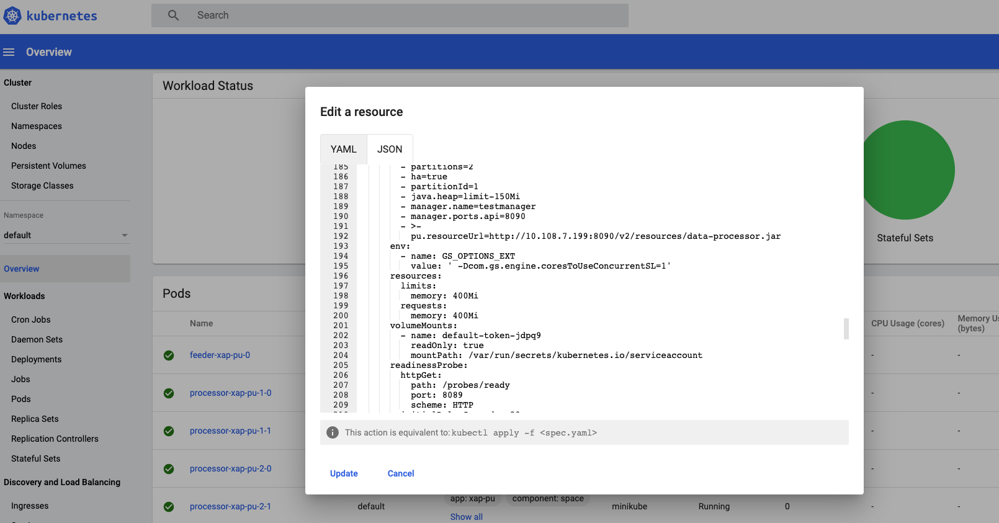
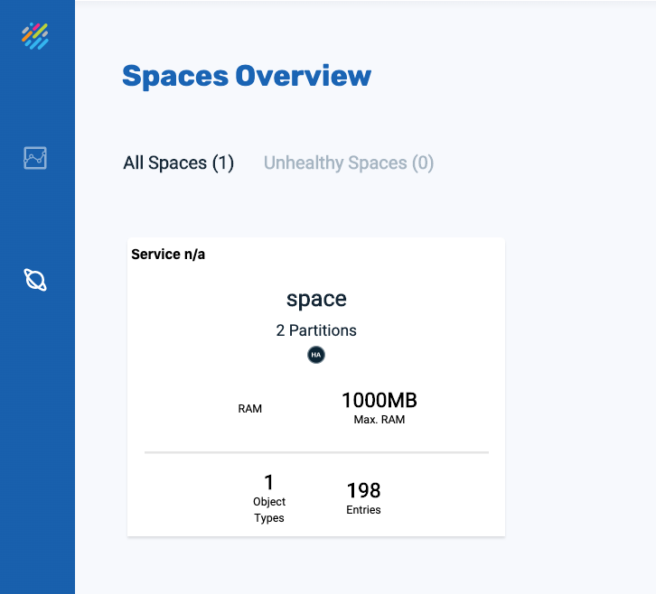
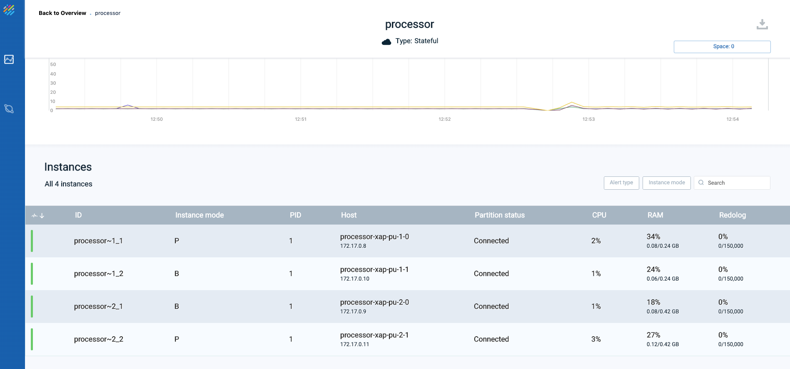
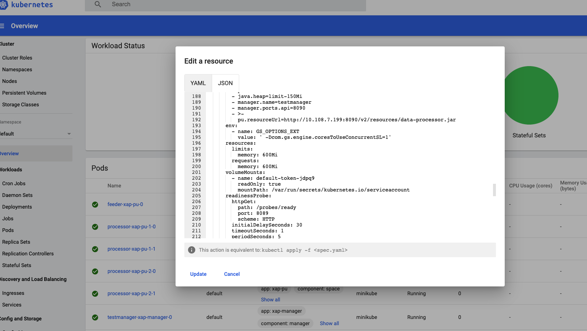

# xap-admin-training - lab14

# Kubernetes & Vertical scaling

## Lab Goals

Get experience with running XAP PU on Kubernetes cluster.   
Perform scale of a statefull pu.  

## Lab Description
In this lab we will deploy manager, statefull processor pu and stateless feeder   
We will perform scaling of the processor pu  

## Prerequisites
Before beginning to work with the data grid and xap, 
ensure that you have the following installed on your local machine or a VM:  

[kubectl](https://kubernetes.io/docs/tasks/tools/install-kubectl/)

[Helm](https://docs.helm.sh/using_helm/#quickstart-guide)  
Important: You must use Helm 2 with KubeGrid. 
Helm 3 contains a new chart version, which is a breaking change and is not currently supported by KubeGrid.
Helm 3 will be supported in XAP 15.5 release

[minikube](https://kubernetes.io/docs/setup/minikube/)  
##### 1. Configure memory and cpu:

    minikube config set memory 4096
    minikube config set cpus 4
    
##### 2. After installation, configure the VM driver 
(for example: in case you installed VirtualBox as the Hypervisor run the following):

    minikube config set vm-driver virtualbox
    
##### 3. Start Minikube:

    minikube start
    
    😄  minikube v1.10.1 on Darwin 10.15.4
    ✨  Using the virtualbox driver based on user configuration
    👍  Starting control plane node minikube in cluster minikube
    🔥  Creating virtualbox VM (CPUs=2, Memory=4096MB, Disk=20000MB) ...
    🐳  Preparing Kubernetes v1.18.2 on Docker 19.03.8 ...
    🔎  Verifying Kubernetes components...
    🌟  Enabled addons: default-storageclass, storage-provisioner
    🏄  Done! kubectl is now configured to use "minikube"
    
##### 4. In a separate terminal expose Minikube LoadBalancer:
 
    minikube tunnel
    

### 1. Deploying and Managing "xap processor feeder application"
#### 1.1  Get the required GigaSpaces Helm charts
##### 1.1.1 run: helm init

    helm init

##### 1.1.2 Add xap Helm Repo to the Repo List 
 
    helm repo add gigaspaces https://resources.gigaspaces.com/helm-charts
    
##### 1.1.3 Fetch the GigaSpaces Helm Charts from the GigaSpaces Repository 
(The chart xap is unpacked in your current directory)

    helm fetch gigaspaces/xap --version=15.2.0 --untar
    
#### 1.2  Deploy a Management Pod called testmanager:

    cd xap/charts
    helm install xap-manager --name testmanager
     
#### 1.3  View and monitor kubernetes deployment
##### 1.3.1 Verify that the pod is running

    Kubectl get pods
    NAME                        READY   STATUS    RESTARTS   AGE
    testmanager-xap-manager-0   1/1     Running   0          5m48s

##### 1.3.2 In a separate terminal open Minikube Dashboard. the browser will automatically open.

    minikube dashboard &
       

##### 1.3.3 Open Gigaspaces Ops Manager

###### 1.3.3.1 Get the manager ip by running "Kubectl get services", the manager ip will be the EXTERNAL-IP. in this case 10.108.7.199

    Kubectl get services
    NAME                              TYPE           CLUSTER-IP     EXTERNAL-IP    PORT(S)                                        AGE
    kubernetes                        ClusterIP      10.96.0.1      <none>         443/TCP                                        4m17s
    testmanager-xap-manager-hs        ClusterIP      None           <none>         2181/TCP,2888/TCP,3888/TCP,4174/TCP            19s
    testmanager-xap-manager-service   LoadBalancer   10.108.7.199   10.108.7.199   8090:32221/TCP,4174:31234/TCP,8200:31837/TCP   19s
                                   
                                   
###### 1.3.3.2 Open Gigaspaces Ops Manager by browsing to <EXTERNAL-IP>:8090 

#### 1.4  Generate the process and feeder jars and upload them

1. `cd <GS_HOME>/examples/data-app/event-processing`
2. `./build.sh package`
3. `<GS_HOME>/bin/gs.sh --server 10.108.7.199`
4. `pu upload <GS_HOME>/examples/data-app/event-processing/processor/target/data-processor.jar` 
    **The result should be:** 
    [data-processor.jar] successfully uploaded
    Resource URL: http://10.108.7.199:8090/v2/resources/data-processor.jar
5. `pu upload <GS_HOME>/examples/data-app/event-processing/feeder/target/data-feeder.jar` 
    **The result should be:** 
    [data-feeder.jar] successfully uploaded
    Resource URL: http://10.108.7.199:8090/v2/resources/data-feeder.jar
    
#### 1.5 Deploy a Data Pod with the processor service

`helm install xap-pu --name processor --set manager.name=testmanager,partitions=2,ha=true,readinessProbe.enabled=true,resourceUrl=http://10.108.7.199:8090/v2/resources/data-processor.jar`

    kubectl get pod
    NAME                        READY   STATUS    RESTARTS   AGE
    processor-xap-pu-1-0        0/1     Running   0          11s
    processor-xap-pu-2-0        0/1     Running   0          11s
    testmanager-xap-manager-0   1/1     Running   0          18m

#### 1.5 Deploy a Data Pod with the feeder service

`helm install xap-pu --name feeder --set manager.name=testmanager,resourceUrl=http://10.108.7.199:8090/v2/resources/data-feeder.jar`

    NAME                        READY   STATUS    RESTARTS   AGE
    feeder-xap-pu-0             1/1     Running   0          11s
    processor-xap-pu-1-0        1/1     Running   0          168m
    processor-xap-pu-1-1        1/1     Running   0          168m
    processor-xap-pu-2-0        1/1     Running   0          174m
    processor-xap-pu-2-1        1/1     Running   0          174m
    testmanager-xap-manager-0   1/1     Running   0          3h21m
    
#### 1.6 View and monitor GS kubernetes deployment

##### 1.6.1 Minikube dashboard

##### 1.6.1 GS Ops Manager 

Click on "Monitor my services" 

Click on "Space" 

Query the data: 

### 2  Vertical Scaling with the GigaSpaces CLI

#### 2.1 Review current RAM occupied by the processor service

1. Click on the "processor" service  

   
   
2. Check the current "processor" service memory using the minikube dashboard: 
   
   
   
3. Click on Space overview:  

   

#### 2.2 Perform memory scale using GS CLI

1. Scale processor partition 2:
   `pu scale processor 2 --memory 600Mi` 
   
   **The result should be:** 
   Request ID     1    
   
   Status can be tracked using the command: request status 1
   
   `request status 1` 
   
   **The result should be:** 
   REQUEST DETAILS    
   ID                 1                                                      
   Description        Patch request for StatefulSet: [processor-xap-pu-2]    
   Status             running                                                
   Submitted By       anonymous                                              
   Submitted From     192.168.99.1                                           
   Submitted At       2020-07-08 09:52:23 
   
   **Finally the result should be:** 
   `request status 1` 
   
   REQUEST DETAILS    
   ID                 1                                                      
   Description        Patch request for StatefulSet: [processor-xap-pu-2]    
   Status             successful                                             
   Submitted By       anonymous                                              
   Submitted From     192.168.99.1                                           
   Submitted At       2020-07-08 09:52:23                                    
   Completed At       2020-07-08 09:54:28
   
2. Partition 2 Memory should be bigger: 
   Looking at GS Ops manager service view: 
   
   
   
   Looking at the minikube dashboard pods view:
   
   
3. Scale processor partition 2:
   `pu scale processor 1 --memory 600Mi` 
   
   **The result should be:** 
   Request ID     2    
   
   Status can be tracked using the command: request status 2
   
   `request status 2` 
      
   **The result should be:** 
   REQUEST DETAILS    
   ID                 2                                                      
   Description        Patch request for StatefulSet: [processor-xap-pu-1]    
   Status             running                                                
   Submitted By       anonymous                                              
   Submitted From     192.168.99.1                                           
   Submitted At       2020-07-08 09:54:53
   
   **Finally the result should be:** 
   `request status 2` 
   
   REQUEST DETAILS    
   ID                 2                                                      
   Description        Patch request for StatefulSet: [processor-xap-pu-1]    
   Status             successful                                             
   Submitted By       anonymous                                              
   Submitted From     192.168.99.1                                           
   Submitted At       2020-07-08 09:54:53                                    
   Completed At       2020-07-08 09:56:37
   
4. Both Partitions Total Memory should be bigger: 
      Looking at GS Ops manager service view: 
      
       
      
      Looking at the Space Overview view: 
      

5. No data is lost and feeder is still working: 
   

6. There is an option also to scale down again. 
   `pu scale processor 1 --memory 400Mi` 
   
   
### 3  Undeploy the services
    helm del --purge feeder
    helm del --purge processor
    helm del --purge testmanager
    
### 4 delete and stop the minikube
    minikube delete
  
  

