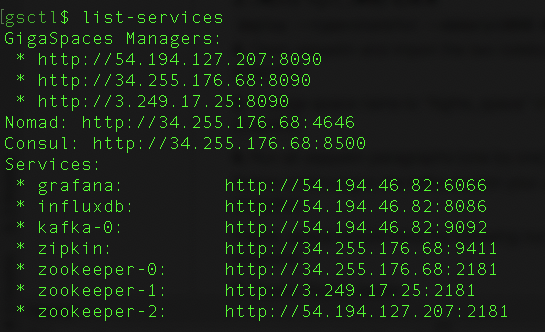
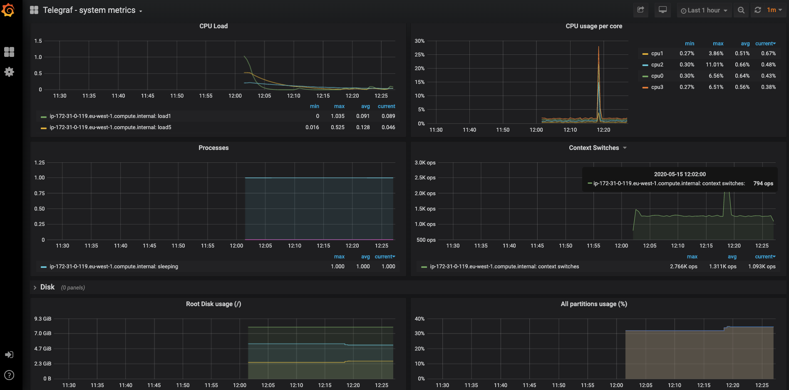

# GSCTL 
## Lab-1: Installation workshop 1-click deploy
* Provision , Manage , Monitor , Deploy on the grid based on aws

## Creating a GigaSpaces Cluster in the Cloud
gsctl is a simple CLI tool for creating GigaSpaces clusters. You can create a cluster in minutes with a single command – `java -jar gsctl.jar create`.

In this topic, you will learn how to create, provision and install a GigaSpaces cluster on Amazon Web Services (AWS) and then remove it by doing the following:

* Create a GigaSpaces cluster.
* Deploy GigaSpaces services in the cluster.
* Undeploy the GigaSpaces services and tear down the cluster.     

### Prerequisites
Before beginning to work with the gsctl tool, ensure that you have the following:

* Java 8 or higher installed on your local workstation.
* AWS account and appropriate credentials as described in the [AWS Command Line Interface documentation](https://docs.aws.amazon.com/cli/latest/userguide/cli-chap-install.html) 

**Note:** 
To deploy a GigaSpaces cluster in AWS you need the following:

* Valid AWS account
* Credentials that include aws_access_key_id and aws_secret_access_key
* Configuration parameters that include a defined aws_region

### Downloading and Running the Utility
The gsctl tool can be downloaded from a [dedicated repository](https://gigaspaces-releases-eu.s3.amazonaws.com/gsctl/15.2.0/gsctl.jar). 
 You can start an interactive shell for gsctl and run commands using short notation, or you can run commands from outside the interactive shell (from the OS shell) by adding `java -jar gsctl.jar` before each command.

**Attention:** 
You must run the utility from the same directory where you placed the gsctl.jar file.

#### To download the gsctl utility and launch the interactive shell:

1. Create an empty directory on your machine. In this example, the drive is C: and the directory name is gsDemo.
2. Download the most current version of the utility (gsctl.jar file) from the dedicated repository to the directory you created (gsDemo).
3. To start the interactive shell, open a command window and type the following: 
    `java -jar gsctl.jar`

## Creating a GigaSpaces Cluster
Follow the steps in the procedure to create a GigaSpaces cluster and deploy the GigaSpaces services. 
All of the procedures on this page describe the short notation as used from inside the interactive shell.

#### To create a cluster:

1. Verify that an `.aws` folder exists in the home directory on your local machine, and that it contains the config and credentials files. 
The credentials file should include your **aws_access_key_id** and **aws_secret_access_key**, and the config files should include your **aws_region**. 
    `ls -l ~/.aws` 
    `-rw-------  1 aharonmoll  staff   29 Apr 23 16:20 config` 
    `-rw-------  1 aharonmoll  staff  116 Apr 23 16:04 credentials` 
2. Open a command window and type the following to initialize the utility and define a cluster called **gs_demo_cluster**: 
`init --cluster-name=gs_demo_cluster` 
The init command creates a cluster.yaml file, which you can modify to supply your AWS resources, such as VPC, keyName, and securityGroups values. 
If you edit any parameter in the AWS section, you must provide all the values for the section. 
**Note:** 
By default, the utility creates all the resources from the credentials and config files in the .aws folder. 

3. To deploy the cluster in the cloud, run the following command: 
    `create` 
The cloud platform begins to create the cluster: 

You can monitor the progress of the cluster in your cloud platform dashboard in AWS. 
The process of creating the cluster takes only a few minutes until the nodes are up and running. 
You can see when the Master (server) nodes and Worker (client) nodes are running and have passed the status checks: 

## Deploying the GigaSpaces Services
After your cluster is up and running, you can deploy GigaSpaces services and microservices. 
The gsctl utility supports deploying stateful, stateless, and web services. The default service type is stateless. 
The gsctl tool comes with sample feeder (stateful) and processor (stateless) services in the Services folder. 
You must use the default artifact repository when deploying the sample services. 
#### To deploy the sample GigaSpaces services:
1. When deploying the sample services, you should first deploy the processor service. 
   As this is a stateful service, you need to specify both the service type and service name. 
   Type the following command to deploy a processor service called **mySpace**: 
   `deploy --type=stateful mySpace data-processor.jar`
2. Next, deploy the feeder service. As this is a stateless service, you only have to specify the service name. 
   Type the following command to deploy a feeder service called **myFeeder**: 
   `deploy --type=stateless myFeeder data-feeder.jar`
## Monitoring the GigaSpaces Services
After you deploy your GigaSpaces services and microservices, you can monitor them using the following built-in web interfaces:

* Ops Manager
* Grafana
* Zipkin
#### To access the administration and monitoring tools:
1. Run the following command: 
   `list-services` 
   This returns all the services with their URLs. 
   
2. Copy any of the GigaSpacesManager URLs into your browser to open Ops Manager and view the deployed GigaSpaces services: 
   
3. Copy the grafana URL to your browser to open Grafana and navigate to the pre-defined dashboards: 
   
4. Select the Telegraf system metrics dashboard in Grafana to view the cluster metrics: 
   
   
   

## Removing a GigaSpaces Cluster
You can delete your cluster when you no longer need it, in order to release the cloud resources. 
First, undeploy the GigaSpaces stateful service, and then tear down the cluster.
#### To remove the GigaSpaces cluster:
1. In the directory where you deployed the GigaSpaces services, type the following command: 
   `undeploy myFeeder`
   The Feeder is undeployed from the cluster. 
   `undeploy mySpace` 
   The Space is undeployed from the cluster. 
2. In the directory where you created the cluster, run the following command: 
   `gsctl.jar destroy` 
   This tears down the cluster and deletes any dynamically created resources. 
   
   