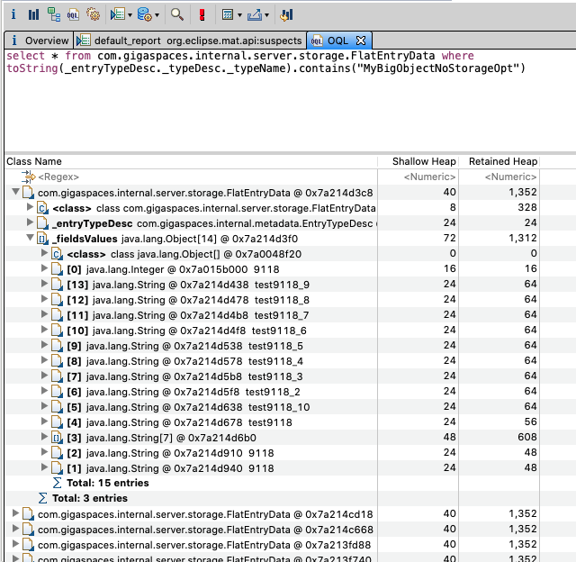
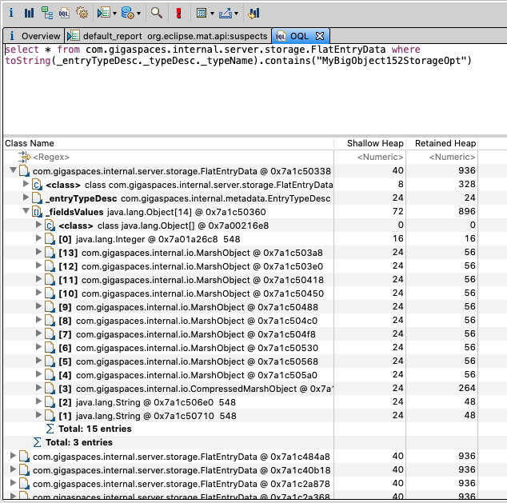

# xap-admin-training - lab16

# Storage Optimization

## Lab Goals

Expireance the powerful of the Storage Optimization feature  

## Lab Description
In this lab we will need to write 4 types of Space Objects. Each type will use a different Storage Optimization. 
You will write each Space Object separately to the space and use Memory Analyzer (MAT) to measure its heap size.  

### Lab Exercise
#### Requirements:  
###### 1. Create 4 different objects according to the following requirements:  

* Space id - Integer  
* Order Index key - String (will be filled with 1 char) 
* Equal and Order key - String  (will be filled with 1 char) 
* Ten properties - String  (will be filled with 5 chars) 
* Payload - String array  (will be filled with 150 chars) 

###### 2. Annotate the 4 Objects as follows   

* The first will not have any optimization. 
* The second will use the Storage Types that has been introduced in version 15.2. See here: https://docs.gigaspaces.com/latest/dev-java/storage-types-controlling-serialization.html?Highlight=storage%20adapters  
* The third will use the new Direct Storage Optimization that has been introduced in version 15.8. See here: https://docs.gigaspaces.com/15.8/dev-java/storage-optimization.html?Highlight=Storage%20optimization  
* The fourth will use the new Sequential Storage Optimization that has been introduced in version 15.8. Same page.   

###### 3. Start the Grid  
    ./gs.sh host run-agent --manager --gsc=1
    
###### 4. Deploy "demo" space with 1 partition (no backup)     
    
###### 5. Write the first type to the space  

* Fill the first type with data. 
* Write 10K instances to the space. 
* Open the Ops Manager and verify that you see the entries.  

###### 6. Take heap dump  
* Open the Ops Manager and take the heap dump of the space. 
* un-deploy "demo" space 

###### 7. Analyze the heap dump  
* Launch the Memory Analyzer (MAT) and open the heap dump you have just created. 
* Verify its size. 
* Open OQL tab and run the following query for MyBigObjectNoStorageOpt: 
select * from com.gigaspaces.internal.server.storage.FlatEntryData where toString(_entryTypeDesc._typeDesc._typeName).contains("MyBigObjectNoStorageOpt")  
 
###### 8. Repeat steps 4-7 for each type  
* run the following query for MyBigObject152StorageOpt:  
select * from com.gigaspaces.internal.server.storage.FlatEntryData where toString(_entryTypeDesc._typeDesc._typeName).contains("MyBigObject152StorageOpt")

* run the following query for MyBigObject158Direct:  
select * from com.gigaspaces.internal.server.storage.HybridEntryData where toString(_entryTypeDesc._typeDesc._typeName).contains("MyBigObject158Direct")

* run the following query for MyBigObject158Sequential:  
select * from com.gigaspaces.internal.server.storage.HybridEntryData where toString(_entryTypeDesc._typeDesc._typeName).contains("MyBigObject158Sequential")

#### Solution

MyBigObjectNoStorageOpt - size 1,352 byte

MyBigObject152StorageOpt - size 936 byte

MyBigObject158Direct - size 472 byte

    * In the new HybridEntryData class it is nice to see the division between the serialized and the non-serialized properties.
    * The new Storage Optimization feature reduced the Space Object by ~60%

MyBigObject158Sequential - size 448 byte

    * In the new HybridEntryData class it is nice to see the division between the serialized and the non-serialized properties.
    * The new Storage Optimization feature reduced the Space Object by ~60%

