# <u>ODSX</u>

- Repositories needed to run Lab

  -  https://github.com/GigaSpaces-ProfessionalServices/gs-odsx.git  (Currently 23-Feb-2022 latest code is available in di_branch)
  -  https://github.com/GigaSpaces-ProfessionalServices/CSM-Magic-Tools.git
  -  https://github.com/Gigaspaces/insightedge-training/tree/master/Day4/17_TieredStorage

## <u>AWS Configurations</u>
1. Create EC2- Instances on AWS based on your requirement (OS: Redhat:7.7 RHEL)
   Minimum Setup : Pivot (ODSX)-1,Manager-3, Space-2,DataIntegration-1,Grafana and Influx - (pivot),Northbound server-1,Northbound management-1, kapacitor (DataIntegration)
   Leumi Env : Pivot (ODSX)-1,Manager-3, Space-4, DataIntegration-4,Grafana and Influx -(pivot),Northbound server-3,Northbound management-3

2. Make each ec2- instances root(user) accessible.

  - By default EC2 instance is with default user ec2-user
 
    sudo sed -e 's/^PermitRootLogin.*/PermitRootLogin without-password/g' -i /etc/ssh/sshd_config
       
    sudo sed -e 's/^AllowUsers.*/AllowUsers ec2-user root/g' -i /etc/ssh/sshd_config
    
    sudo -s
    
    cd
    
    sudo sed -e 's/no-port/#no-port/g' -i ~/.ssh/authorized_keys
    
    sudo sed -e 's/ssh-rsa/\nssh-rsa/g' -i ~/.ssh/authorized_keys
    
    useradd gsods
    
    mkdir /home/dbsh
    mkdir /opt/Kafka
    
    mkdir /dbagigasoft
    '

### <u>Environment setup (STATELESS ODSX)</u>
  - Select EFS from AWS :
  
  - In AWS go to EFS -> create -> 
  
  - Make sure security group is same for EFS and EC2 user
  - For Pivot machine create directory structure same as app.yaml file
      - sudo mkdir -p /dbagigashare/current/data-integration/di-manager/ /dbagigashare/current/data-integration/di-mdm/ /dbagigashare/current/data-integration/di-flink/ /dbagigashare/current/telegraf/jars /dbagigashare/current/grafana/dashboards/ /dbagigashare/current/telegraf/sctipts/space /dbagigashare/current/telegraf/scripts/space /dbagigashare/current/telegraf/config/pivot /dbagigashare/current/telegraf/config/agent /dbagigashare/current/kapacitor/config /dbagigashare/current/kapacitor/templates /dbagigashare/current/kapacitor/alerts /dbagigashare/current/gs/upgrade /dbagigashare/current/gs/config/space /dbagigashare/current/gs/config/metrics /dbagigashare/current/gs/jars/space /dbagigashare/current/gs/config/license /dbagigashare/current/grafana/catalog/jars /dbagigashare/current/data-validator/files /dbagigashare/current/data-validator/jars /dbagigashare/current/gs/jars/ts /dbagigashare/current/mq-connector/adabas/jars /dbagigashare/current/mq-connector/adabas/config /dbagigashare/current/mssql/files /dbagigashare/current/mq-connector /dbagigashare/current/security/jars/cef /dbagigashare/current/gs/config/log/ /dbagigashare/current/gs/jars /dbagigashare/current/gs/config/ts /dbagigashare/current/odsx /dbagigashare/current/mssql/jars /dbagigashare/current/mssql/scripts /dbagigashare/current/db2/jars /dbagigashare/current/db2/scripts /dbagigashare/current/cr8 /dbagigashare/current/grafana /dbagigashare/current/influx /dbagigashare/current/gs /dbagigashare/current/jdk /dbagigashare/current/kafka /dbagigashare/current/nb /dbagigashare/current/nb/applicative/ssl /dbagigashare/current/nb/management/ssl /dbagigashare/current/sqlite /dbagigashare/current/security /dbagigashare/current/unzip /dbagigashare/current/zk /dbagigashare/current/telegraf
  - Go to EFS -> created EFS -> Click on Attach copy the command and point to /dbagigashare instead of efs
  
  -Get Details of efs to mount directory
  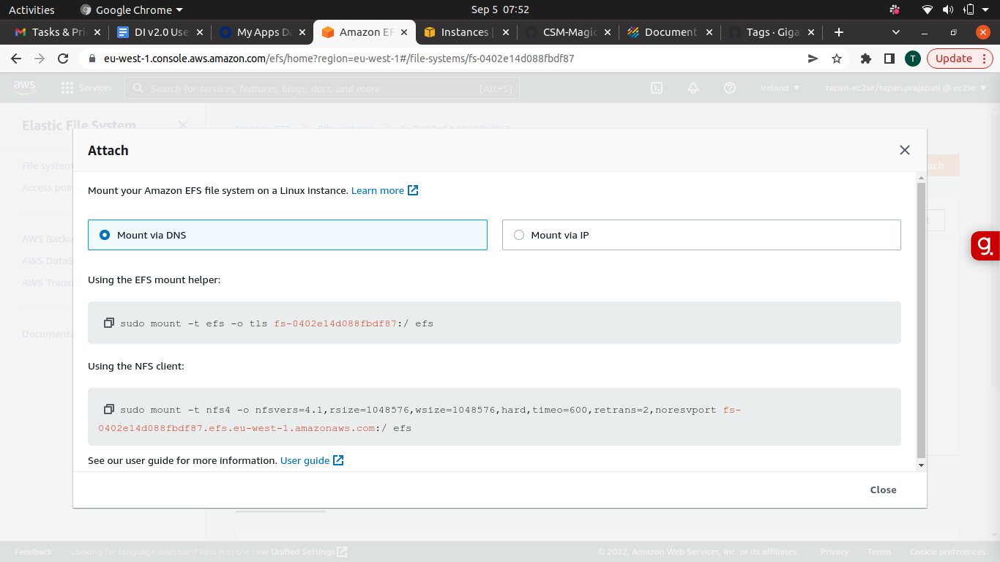
  - Go to other machine create directory /dbagigashare,  install NFS and run same attach command to mount created shared directory /dbagigashare
  - Run / Install NFS : sudo yum install -y nfs-utils
  - Mount shared file location /dbagigashare/current in AWS with all installer servers (NFS).

### <u>Download Installers on mounted folders </u>
  - Copy respected installers inside folders 
      
      -/dbagigashare/current/unzip : https://tapangigaspaces.s3.us-east-2.amazonaws.com/odsx/install/unzip/unzip-6.0-21.el7.x86_64.rpm
      -/dbagigashare/current/gs : https://tapangigaspaces.s3.us-east-2.amazonaws.com/odsx/install/gs/gigaspaces-smart-ods-enterprise-16.0.0.zip
      -/dbagigashare/current/gs/config/ : https://tapangigaspaces.s3.us-east-2.amazonaws.com/odsx/install/gs/xap_logging.properties
      -/dbagigashare/current/gs/config/ : https://tapangigaspaces.s3.us-east-2.amazonaws.com/odsx/install/gs/space.properties
                                          https://tapangigaspaces.s3.us-east-2.amazonaws.com/odsx/install/gs/spaceproperty.properties
                                          https://tapangigaspaces.s3.us-east-2.amazonaws.com/odsx/install/gs/TieredCriteria.tab
      -/dbagigashare/current/db2/jars/  :https://tapangigaspaces.s3.us-east-2.amazonaws.com/odsx/install/db2/db2jcc_license_cu-4.16.53.jar
                                         https://tapangigaspaces.s3.us-east-2.amazonaws.com/odsx/install/db2/db2jcc-4.26.14.jar
      -/dbagigashare/current/db2/scripts/ : https://tapangigaspaces.s3.us-east-2.amazonaws.com/odsx/install/db2/load_JOTBMF11_MATI_ISKY.sh
      -/dbagigashare/current/mssql/files/ : https://tapangigaspaces.s3.us-east-2.amazonaws.com/odsx/install/mssql/SQLJDBCDriver.conf
                                            https://tapangigaspaces.s3.us-east-2.amazonaws.com/odsx/install/mssql/udkods2.keytab
      -/dbagigashare/current/mssql/jars/ : https://tapangigaspaces.s3.us-east-2.amazonaws.com/odsx/install/mssql/mssqlFeeder-1.0.0.jar
      -/dbagigashare/current/mssql/scripts/ : https://tapangigaspaces.s3.us-east-2.amazonaws.com/odsx/install/mssql/load_JOTBMF01_TN_MATI.sh                         
      
      -/dbagigashare/current/nb : https://tapangigaspaces.s3.us-east-2.amazonaws.com/odsx/install/nb/nb-infra-0.0.21.tar.gz
      -/dbagigashare/current/nb/applicative/ : https://tapangigaspaces.s3.us-east-2.amazonaws.com/odsx/install/nb/nb.conf.template
      -/dbagigashare/current/nb/management/  : https://tapangigaspaces.s3.us-east-2.amazonaws.com/odsx/install/nb/nb.conf.template
      
      -/dbagigashare/current/grafana : https://tapangigaspaces.s3.us-east-2.amazonaws.com/odsx/install/grafana/grafana-7.3.7-1.x86_64.rpm
                                     https://tapangigaspaces.s3.us-east-2.amazonaws.com/odsx/install/grafana/gs_config.yaml
      -/dbagigashare/current/grafana/catalog/jars/ : https://tapangigaspaces.s3.us-east-2.amazonaws.com/odsx/install/grafana/catalogue-service.jar                                       
      
      -/dbagigashare/current/influx : https://tapangigaspaces.s3.us-east-2.amazonaws.com/odsx/install/influxdb/influxdb-1.8.4.x86_64.rpm
      
      -/dbagigashare/current/kafka : https://tapangigaspaces.s3.us-east-2.amazonaws.com/odsx/install/kafka/kafka_2.13-2.8.1.tgz
      
      -/dbagigashare/current/zk : https://dlcdn.apache.org/zookeeper/zookeeper-3.6.3/apache-zookeeper-3.6.3-bin.tar.gz
      
      -/dbagigashare/current/kafka : https://tapangigaspaces.s3.us-east-2.amazonaws.com/odsx/install/jolokia/jolokia-agent.jar
      
      -/dbagigashare/current/telegraf : https://dl.influxdata.com/telegraf/releases/telegraf-1.19.3-1.x86_64.rpm
          -Create same directory structure as : https://github.com/GigaSpaces-ProfessionalServices/CSM-Magic-Tools/tree/master/alerts/telegraf
      
      -/dbagigashare/current/kapacitor : https://repos.influxdata.com/rhel/8/x86_64/stable/kapacitor-1.6.2-1.x86_64.rpm
      -/dbagigashare/current/kapacitor: http://www6.atomicorp.com/channels/atomic/centos/7/x86_64/RPMS/jq-1.6-2.el7.x86_64.rpm
      -/dbagigashare/current/kapacitor: http://www6.atomicorp.com/channels/atomic/centos/7/x86_64/RPMS/oniguruma-6.8.2-1.el7.x86_64.rpm
        - For more directories and supporting files
          - Ref : https://github.com/GigaSpaces-ProfessionalServices/CSM-Magic-Tools/tree/master/alerts/kapacitor
          
      -/dbagigashare/current/security/config : https://tapangigaspaces.s3.us-east-2.amazonaws.com/odsx/install/security/ldap-security-config.xml
      -/dbagigashare/current/security/jars  : https://tapangigaspaces.s3.us-east-2.amazonaws.com/odsx/install/security/spring-ldap-core-2.3.3.RELEASE.jar
                                              https://tapangigaspaces.s3.us-east-2.amazonaws.com/odsx/install/security/spring-security-ldap-5.1.7.RELEASE.jar
                                              https://tapangigaspaces.s3.us-east-2.amazonaws.com/odsx/install/security/VaultSupport-1.0-SNAPSHOT.jar
      -/dbagigashare/current/security/cef/jars : https://tapangigaspaces.s3.us-east-2.amazonaws.com/odsx/install/security/CEFLogger-1.0-SNAPSHOT.jar
      
      -/dbagigashare/current/data-integration/dim/ : https://giga-di.s3.eu-west-1.amazonaws.com/di-packages/manualBuild/di-manager-0.0.12.4.tar.gz 
      -/dbagigashare/current/data-integration/mdm/ : https://giga-di.s3.eu-west-1.amazonaws.com/di-packages/manualBuild/di-mdm-0.0.12.4.tar.gz 
      -/dbagigashare/current/data-integration/flink : https://giga-di.s3.eu-west-1.amazonaws.com/Flink/flink-1.15.0-bin-scala_2.12.tgz
                                                   
      -/dbagigashare/current/gs/config/license/gs-license.txt write tryme or if you have valid license then put it.
      
      -Copy <odsx>/config/metrics.xml.template /dbagigashare/current/gs/config/metrics/
      -Copy <odsx>/config/nb.conf.template To /dbagigashare/current/applicative 
                                              /dbagigashare/current/management

### <u>Installers on mount </u>
  - Listed directories after creation on mounted servers/ hosts
  - 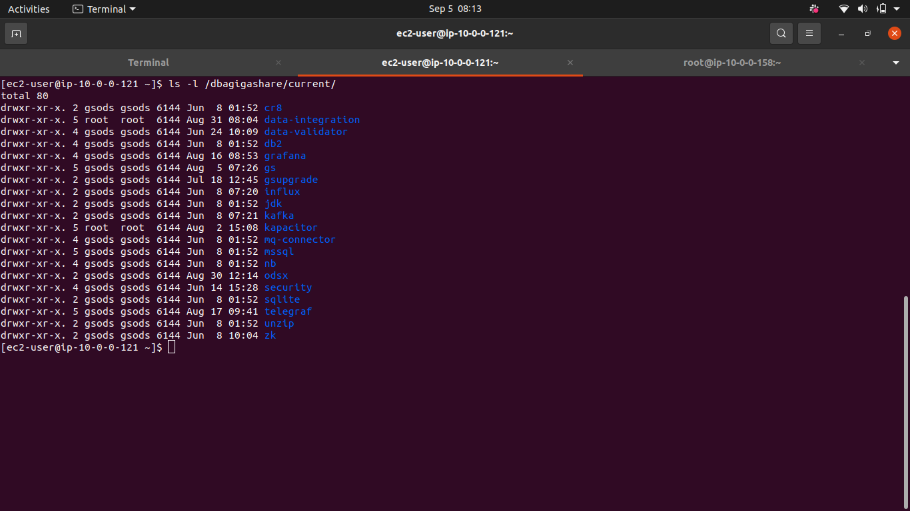
  - 
  - 
  - 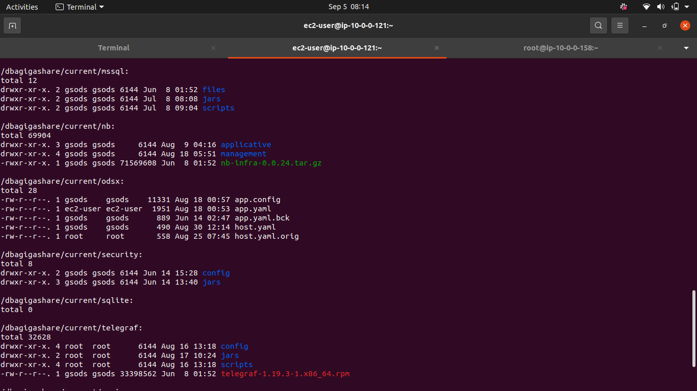
  - 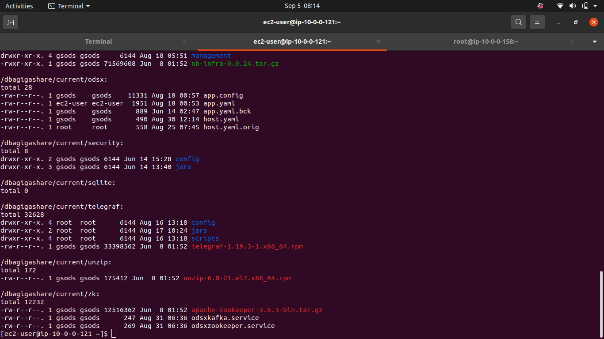 

### <u>ODSX Configuration setup(STATELESS ODSX)</u>
  - GIT URL : https://github.com/GigaSpaces-ProfessionalServices/gs-odsx/tags
  
  - Download suffix with release so you will get mail branch which is simillar to bank env 
  - Trace odsx version by tags suffix.  
  - Download from git or copy .zip file to pivot / odsx server which will act as admin
  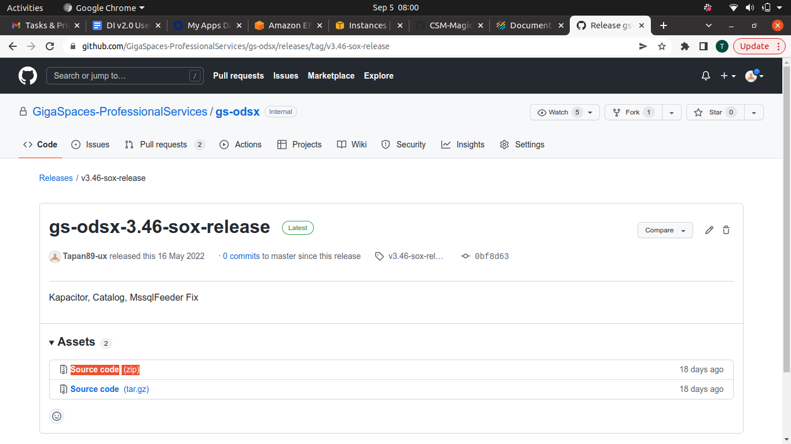
  - Unzip the .zip file check pythonpath in .bashrc or .bash_profile it should point to current unzipped odsx version.
  - export PYTHONPATH=/home/ec2-user/gs-odsx-3.46-sox-release
  - Open terminal and go to scripts folder
    -  [ec2-user@ip-10-0-0-121 scripts]$ pwd
       /home/ec2-user/gs-odsx-3.46-sox-release/scripts
       [ec2-user@ip-10-0-0-121 scripts]$ ./setup.sh 
    -  Run ./setup.sh
  - Copy <gs-odsx-home>/config/app.config, host.yaml, app.yaml -> files into /dbagigashare/current/odsx/
  - Go to odsx folder and run ./odsx.py file. Check whether menu is popuo or not.
  - If you are on AWS EC2 then modify flag cluster.usingPemFile=True
  - Uncomment or add your pem file cluster.pemFile=
  - Security : app.setup.profile=security  if you want to do secure setup
            - For unsecure installation : app.setup.profile= (keep blank)
  - If you are on DR envirounment app.setup.env=#dr (remove #) app.setup.env=dr

### <u>ODSX Configuration security setup</u>
  - app.config : app.setup.profile=security
  - After security installation of Manager, Space servers go to /dbagiga/gigaspaces-smart-ods/config/security/security.properties Make sure below configuration is present
    - com.gs.security.security-manager.class=com.gigaspaces.security.spring.SpringSecurityManager
      spring-security-config-location=../config/security/security-config.xml
  - Go to respected scripts files and mention user / password = gs-admin (ONLY FOR AWS EC2 these changes shold not committed) 
     Example : odsx_security_servers_manager_list.py
        username = "gs-admin"#str(getUsernameByHost(managerHost,appId,safeId,objectId))
        password = "gs-admin"#str(getPasswordByHost(managerHost,appId,safeId,objectId))

### <u>ODSX Configuration new host / supporting jar setup</u>
  - Configurations for new host section need to be done under utils/ods_cluster_config.py
  - To add new host Example : 2 space servers but need to add 4 then
  - host.yaml -> add entries host1,host2 ... host4 and mention the respected IP / hostname
  - app.yaml maintain the supporting jars in yaml configuration
     Example : 
     gs:
         config:
           log:
             xap_logging: xap_logging.properties
                
### <u>Installation</u>

1. Clone this project from git repository.
   
    URL : https://github.com/GigaSpaces-ProfessionalServices/gs-odsx.git
    
2. Open terminal and go to scripts folder 

   cd gs-odsx/scripts

3. Run setup script using 

   ./setup.sh
  - Exit from terminal and Re-login to Pivot (ODSX) machine
4. Give permission to your pem file

  - chmod 400 gs-odsx/aharon_ami.pem

### <u>SetupFiles</u>

### <u>Usage</u>

    Go to main Project directory from terminal window (cd gs-odsx-3.46-sox-release/)
### <u>Host configurations</u>
  - Copy <gs-odsx-home>/config/app.config, host.yaml, app.yaml -> files into /dbagigashare/current/odsx/
  - Configure required hosts for respected feature installer
    
  - 
**Menu driven** 

Run below will start displaying various menu options 

./odsx.py

**1. Install DI server(Kafka) Menu -> Servers -> DI**
###  Install
 - Install DI with cluster mode
   - 3/4 host / servers needed to install 
   - Single node also supports.
   - 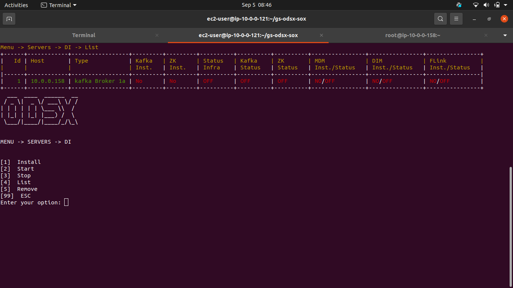
   - 
   - 
   - Verify by List
   - 

### Start   
- After installation complete start DI servers
- Verify DI servers by logged in to any of host and execute below command:

 - 
 - 
 - Verify by List
 - 

    source /home/dbsh/setenv.sh;
    $ZOOKEEPERPATH/bin/zkCli.sh -server localhost:2181 <<< "ls /brokers/ids" | tail -n 2

 

### Stop
   - 
   - Verify by list  

### Remove
   - 
   - 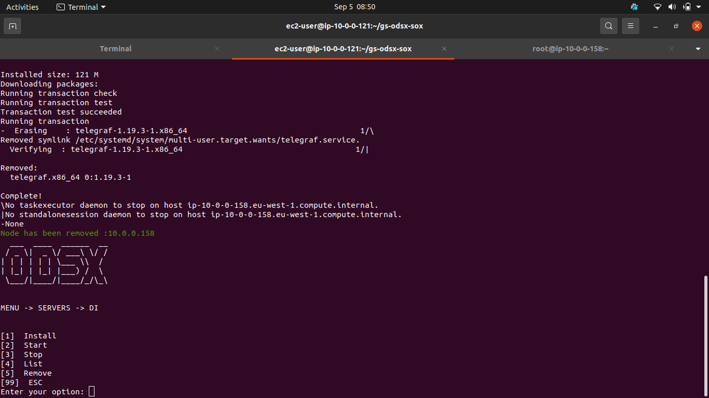
   - Verify by List

**Grafana Server (Menu -> Servers -> Grafana)**

###### Install

- Keep Grafana rpm file under /dbagigashare/current/grafana/grafana-7.3.7-1.x86_64.rpm

- 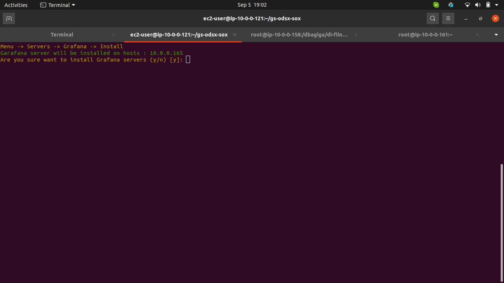

###### Start

- It will start Grafana server
 - Verify Grafana started or not by http://< Grafana host >:3000/ web browser

 
 - Verify after starting grafana on UI
 - <host>:3000 
 - Username/Password : admin/admin
 

###### Stop

- It will stop Grafana service on installed host
  - 
###### Remove
- It will Remove and uninstall Grafana host

**Influxdb (Menu -> Servers -> Influxdb)**

###### Install
- Keep rpm file under /dbagigashare/current/influx/ 
- By default service will start and create default database mydb

###### Start

- It will start influxdb service 
- Verify it by :
    - [root@ip-10-0-0-165 ~]# influx
      -Connected to http://localhost:8086 version 1.8.4
      =InfluxDB shell version: 1.8.4
      
      influx> show databases
      - name: databases
        
        name
        ----
        mydb
        _internal
        telegraf
        
      influx> use mydb
        
        Using database mydb
        
      influx> show measurements
        
        name: measurements
        name
        ----
        jvm_memory_gc_count
        jvm_memory_gc_time
        .....
###### Stop

- It will stop influxdb service on installed host

###### Remove
- It will Remove and uninstll Infuxdb host

**Manager (Menu -> Servers -> Manager)**

###### Install  
  - This option will install manager and prerequisite software for running Manager (**On Remote machine**).
    
  - Example  :

    java : /dbagigashare/current/jdk/jdk-11.0.11_linux-x64_bin.rpm 

    unzip : /dbagigashare/current/unzip/unzip-6.0-21.el7.x86_64.rpm 

    gs  : /dbagigashare/current/gs/gigaspaces-xap-enterprise-16.0.0.zip
    license : Configure license under /dbagigashare/current/gs/config/license/gs-license.txt
    ##### Read summary carefully each parameter need to configure    
    
    - Proceed with Installation Param up to final confirmation of installation.
   
    
    After completion of installation do list
    
    - Menu -> Servers -> Manager -> List
    
    
  
   - It will add the newly installed manager into cluster.config file as place holders instead of host.

###### Start

- This option will start the manager which is installed on remote machine.
- By default it will start all, you can choose menu for individual start
  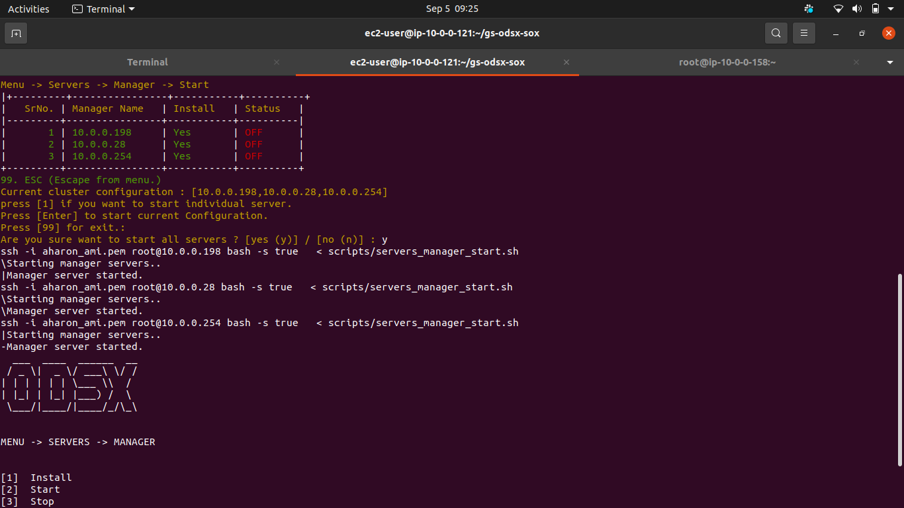
  
  Verify manager start with browser. 
  - Verify with old ui
  
  - Verify with ops manager
  
  - Verify with odsx
  
###### Stop

- This option will stop the manager which is currently running on remote machine.
  - Verify manager stop with browser. 
  - Verify with old ui
  
  - Verify with ops manager
  
  - Verify with odsx
  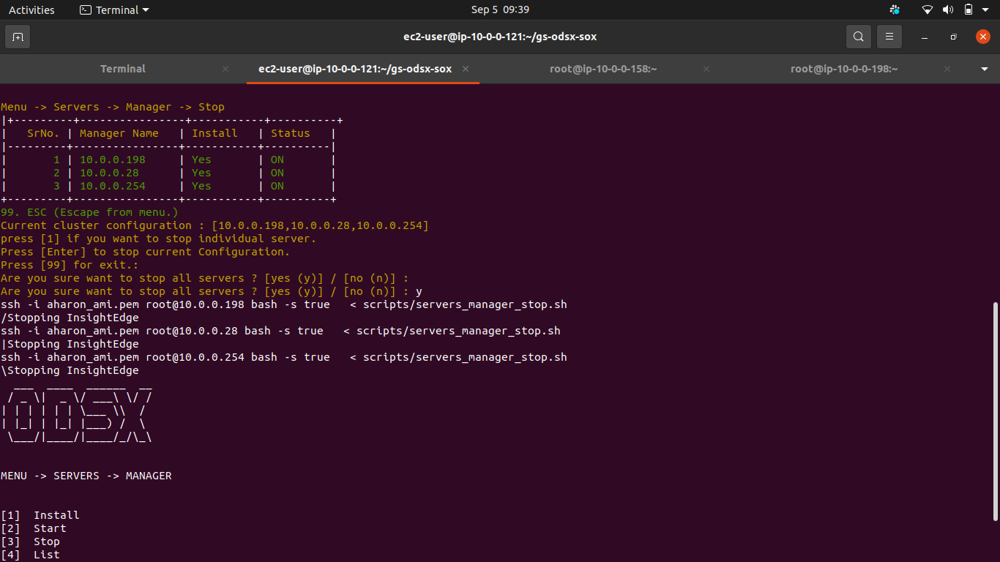

###### List

- It will list out the configured manager from the cluster.config file.
 -   

  

###### Remove

- It will remove installed manager servers from cluster config and optional to remove supported software java / unzip

###### Upgrade
   - You can change the version of manager 
   - Put GS installer under /dbagigashare/current/gs/upgrade/ 
     - [ec2-user@ip-10-0-0-121 gs-odsx-sox]$ ls /dbagigashare/current/gs/upgrade/
       gigaspaces-smart-dih-enterprise-16.2.0-m4-sun-10.zip
   
   
   
    
   - Verify it by odsx List
   
   
###### Rollback
   - This option will rollback upgraded version to previous one
   
   
   - Verify it by odsx list
   

**Space Server (Menu -> Servers -> Space)**

###### Install

  - This option will install space server and prerequisite software for running Space server (**On Remote machine**).
    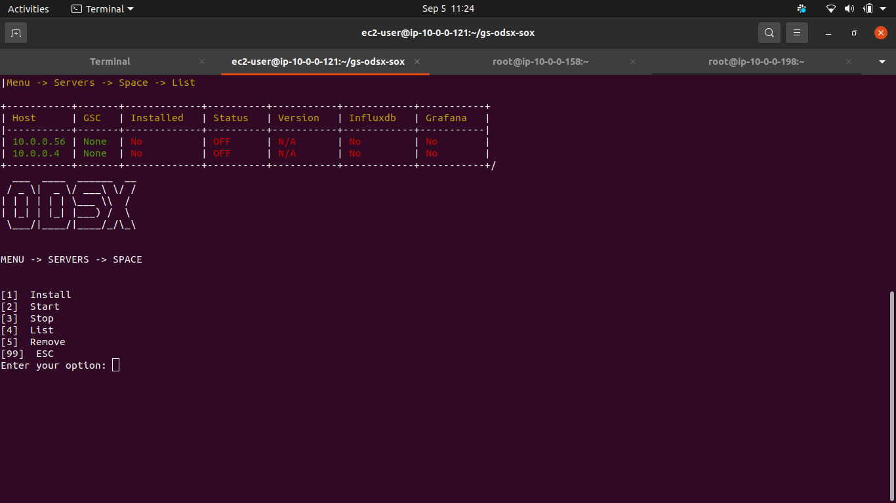
  - Example  :

    java : /dbagigashare/current/jdk/jdk-11.0.11_linux-x64_bin.rpm 

    unzip : /dbagigashare/current/unzip/unzip-6.0-21.el7.x86_64.rpm 

    gs  : /dbagigashare/current/gs/gigaspaces-xap-enterprise-16.0.0.zip
    
    - Verify number of GSC and Memory required for GSCs
    
    
    
###### Start 

- This option will start the stopped space servers with specified GSC / manager / region at the time of installation
 - Space sever will take time curerntly sleep time is 60 Secs it will up all GSCs
 - Based on number of input GSCs it will take time to up.

  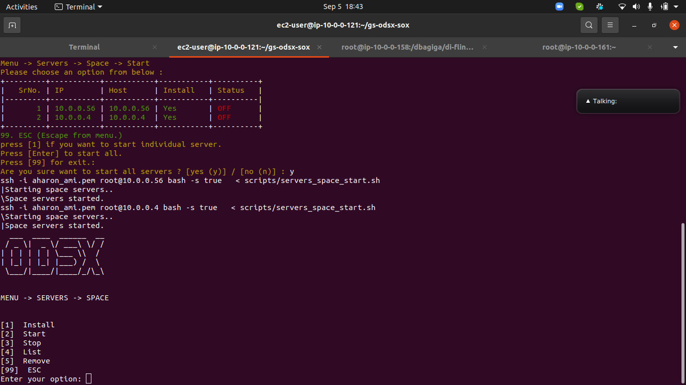

  
  
  
       
###### Stop 

- This option will stop the space server

  
  
  

###### Remove

- It will remove installed manager servers from cluster config and optional to remove supported software java / unzip 

**Tiered Storage (Menu -> Tiered Storage)**

###### Deploy

 - You can find it from git repository https://github.com/GigaSpaces-ProfessionalServices/CSM-Magic-Tools.git
 - Build project and copy Bi_Optional_pu.jar file into odsx machine
 - Specify source path of this jar at time of Deploy Step
 - It will provide you an option for to create GSC
 - You can specify zone, number of partitions, space property at time of deployment

  
  
  
  
  
  
  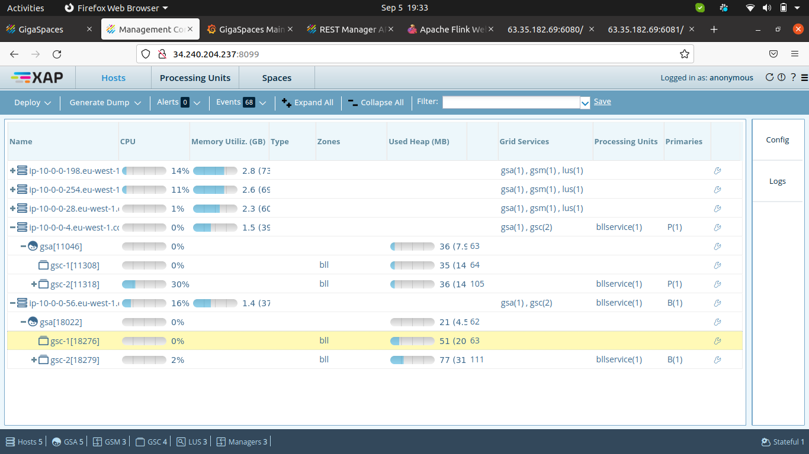
  
 - Run Feeder from manager server

  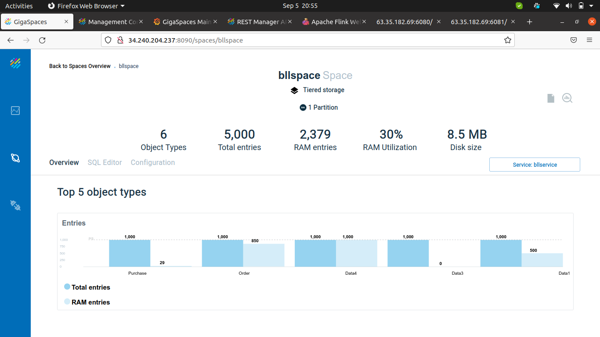

 - By default it will loaded with default criteria file TieredCriteria.tab
 - Verify the deployment on OPS manager  

  

###### List
 - Verify it on odsx
 - 

###### Update Cache Policy

 - Modify your criteria / space property required to update from source file
 - Select space which you want to apply udpdate cache policy
 - One can select individual couple partition or all available partitions
   - It will restart backup from couple 
   - Once backup partition restarted it will wait for space to become healthy

    
    
    

 - This step will demote the selected couple partition
 - After completion of update cache policy Go to OPS manager and see the updated criteria on overview
    
  
  
  

  - You can observe after changing the TieredCriteria.tab file based on updated criteria data feeded without downtime of space

  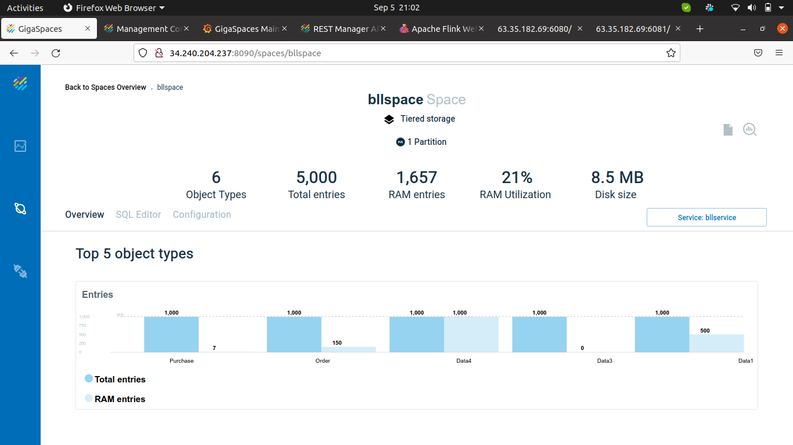

###### Undeploy

- It will list all available spaces on cluster
- You can remove / undeploy either one or all available spaces from cluster 

    

**Northbound (Menu -> Servers -> Northbound)**

###### Install
  - NB Applicative - different host
  - NB Management -  different host
  - NB Agent - Space host
  - Installation is two type all or individual
    -Individual - one can perform individual installation of NB Applicative / Management / Agent
    - All - one can install all at once
  - Copy <odsx>/config/nb.conf.template into 
    - /dbagigashare/current/nb/management
    - /dbagigashare/current/nb/applicative
    
  - Applicative : 
   -  Verify configuration and sever details
    
    
    
    
    
    
    
    - Verify it on odsx status
  - Management :
   -  Verify configuration and sever details
    
    
    
    
    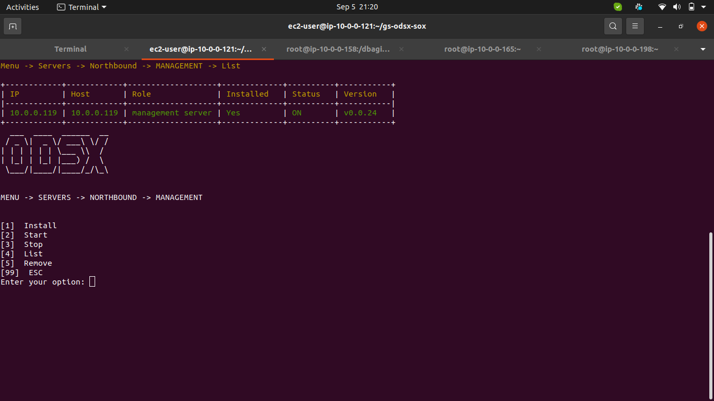
    - Verify it on odsx status
  - Agent :
    -  Verify configuration and sever details
    
    
    
    
    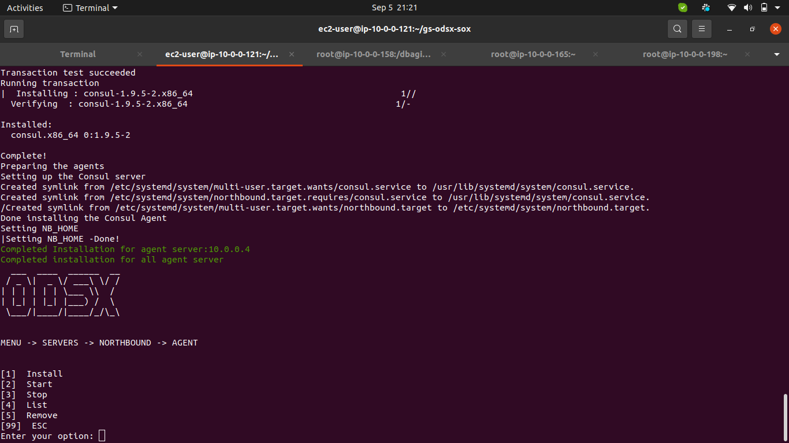
    - Verify it on odsx status
    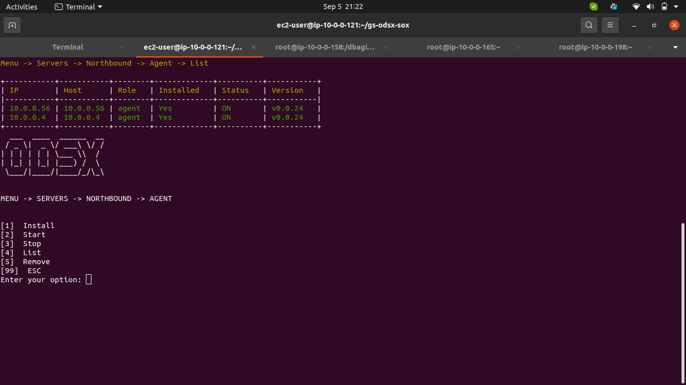
###### Start

- It will start northbound service on specified server   
###### Stop

- It will stop northbound service on specified server

###### Remove

- It will remove and uninstall northbound service on specified server

**DB2-Feeder (Menu -> DataEngine -> DB2-Feeder -> Install-Deploy)**

###### Install-Deploy
   - For AWS we are using jars of tiered storage which will be deployed as feeder
      (Bcoz MQ setup is not there)
   - Main db2-Feeder jar required under /dbagigashare/current/db2/jars/ 
   - Feeders will be deployed same as mentioned file in /dbagigashare/current/db2/scripts/
        - scripts files which are starting with load_* will be consider as feeder only 
   - GSC container which will create based on script file name + pu deployed based on script file name
   - Entries will be persisted in sqlite3 database as displayed path in summary
   
   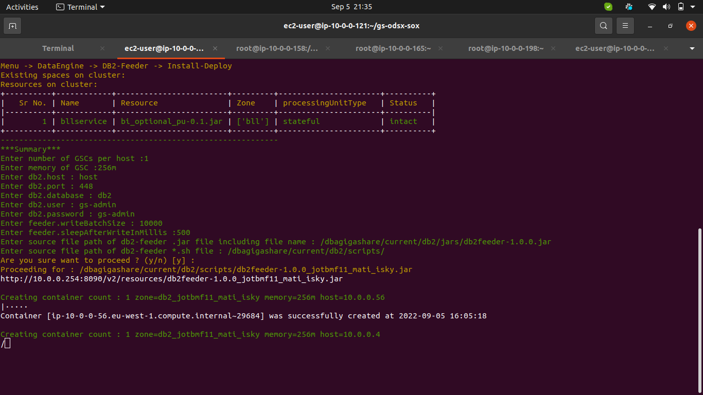
   
   - completion of feeeder deployment
   
   

##### List
   - Verify feeder status on odsx and UI it should be intact
       
   
   
   

##### Start
   - This command will start feeder but work in bank or where ever mq connectivity is present
##### Stop   
   - This command will stop feeder but work in bank or where ever mq connectivity is present 
##### Reset_database
   - This command will reset the database table entires to avoid port conflict    
##### Undeploy
   - This will undeploy the deployed feeder and kill the created GSCs
   
   

**MSSQL-Feeder (Menu -> DataEngine -> MSSQL-Feeder -> Install-Deploy)**

###### Install-Deploy
   - For AWS we are using jars of tiered storage which will be deployed as feeder
      (Bcoz MQ setup is not there)
   - Main Mssql-Feeder jar required under /dbagigashare/current/mssql/jars/ 
   - Feeders will be deployed same as mentioned file in /dbagigashare/current/db2/scripts/
        - scripts files which are starting with load_* will be consider as feeder only 
   - GSC container which will create based on script file name + pu deployed based on script file name
   - Entries will be persisted in sqlite3 database as displayed path in summary
   
   
   
   - completion of feeeder deployment
   
   
   
   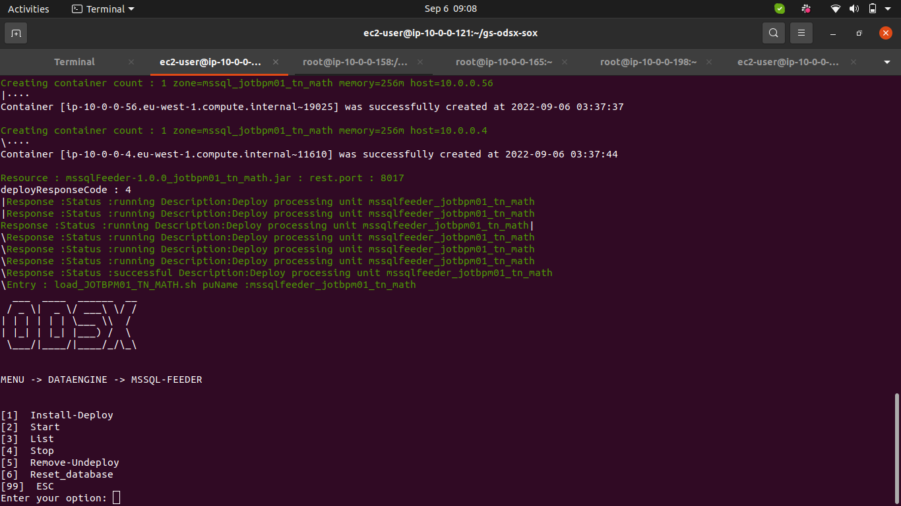

##### List
   - Verify feeder status on odsx and UI it should be intact
       
   
   
   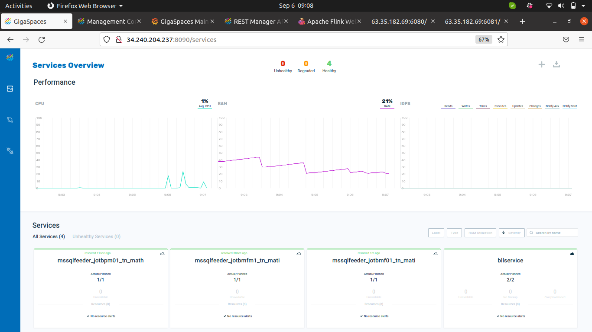

##### Start
   - This command will start feeder but work in bank or where ever mq connectivity is present
##### Stop   
   - This command will stop feeder but work in bank or where ever mq connectivity is present 
##### Reset_database
   - This command will reset the database table entires to avoid port conflict    
##### Undeploy
   - This will undeploy the deployed feeder and kill the created GSCs
   
   
   
      
   
   
**MQ-Connector- Adabas service (Menu -> DataEngine -> MQ-connector -> Adabas-service)**

###### Install-Deploy

   - Keep required service file under : /dbagigashare/current/mq-connector/adabas/jars/
    
   
   
   
   
   

##### List
   
   

##### Start
   - This command will start adabs service
##### Stop   
   - This command will stop adabs service 
##### Remove
      
   
   
  
**MQ-Connector- Kafka consumer (Menu -> DataEngine -> MQ-connector -> Kafka consumer)**

###### Install-Deploy

   - Keep required service file under : /dbagigashare/current/mq-connector/adabas/jars/
    
   
   
   
   - verify it by odsx 
   
   
   - verify it by UI
   

##### List
   
   

##### Undeploy
   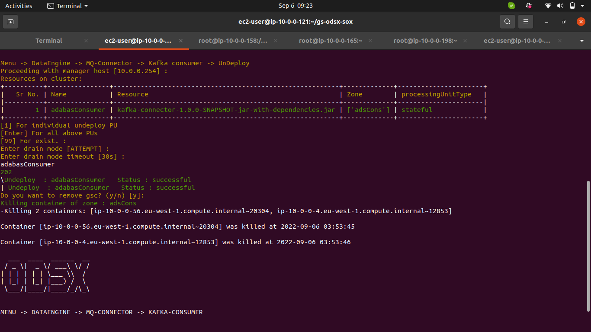   
        