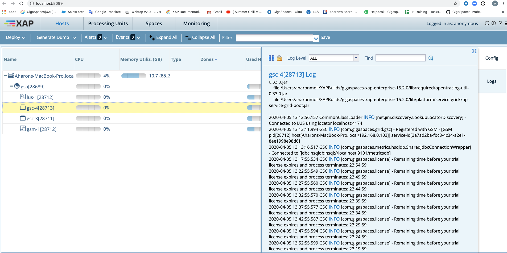
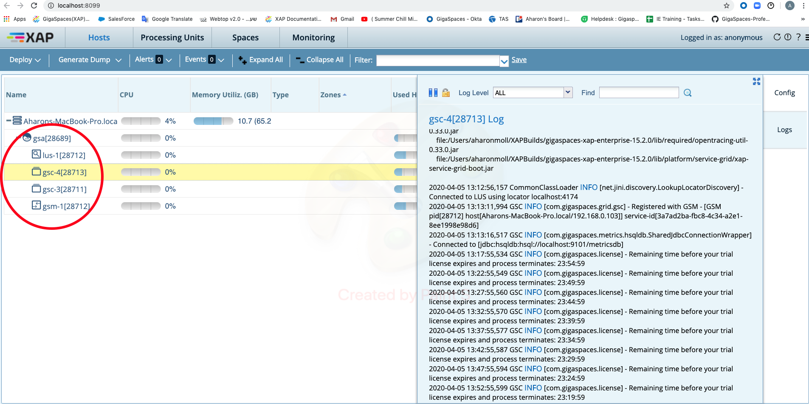

# xap-admin-training - lab3-guide

##    Grid Service Components

###### Lab Goals
*   Be introduced and experienced Grid Service Components

###### Lab Description
In this lab you will start GS infrastructure services. Inspect the runtime grid in the GS-UI.

## 1	Start GS Infrastructure  

    a.	Go to $GS_HOME/bin
    b.	./gs.sh host run-agent --auto --gsc=2
    
## 2	Examine the running environment  

    a.	Examine the ‘gigaspaces-manager.log’ Check the GSM and GSCs have started and registered successfully 

    b.	Go to the web Management Console (localhost:8099)
    c.	Press the host tab
    d.	Press on the gsc processes to see the process information and log.

## 3	Self-Healing

In this exercise you will be introduced to the self-healing capabilities of the In Memory Data Grid.  
Basically we will ‘kill’ (using task manager or kill -9) a GSC process and see that it restarts automatically by the gs-agent and that new partition are created accordingly  

3.1	Kill a GSC  

Each process ID (all are JVMS) is shown at the Hosts tab (see red circle below).  
Choose 1 of the GSCs PID and use the Task Manager or in order to kill the process.  
If PID is not shown at the Task Manager simply choose “view -> select columns” and add the PID column.  
For Linux use: kill -9 <PID>

3.2	Return to the web Management Console in order to check the recovery status.

3.3	The following is the Self-Healing processes  

    a. GSC was re-launched by gs-agent
    
 

3.4	Stop the runtime grid  

    a.	Press on the GSA
    b.	Click to open GSA Actions
    c.	Select shutdown
    
 

