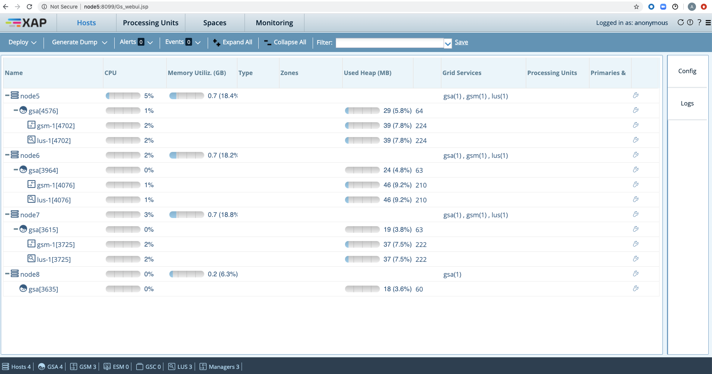

# xap-admin-training - lab8

# GigaSpaces XAP manager 

## Lab Goals

**1.** See how easy it is to setup XAP cluster 
**2.** Get familiar with XAP Manager capabilities 

## Lab Description
In this lab we will focus on XAP Manager functionalities. 
To better know its capabilities you will set up 4 machine cluster based on Vagrant 

### 1 Setup Vagrant framework on your machine

#### 1.1 Install VirtualBox

https://www.virtualbox.org/wiki/Downloads

#### 1.2 Install Vagrant

https://www.vagrantup.com/downloads.html

### 2 “vagrant up” and Provisioning your Virtual Machine

**1)**   `cd ~/xap-admin-training/xap-admin-training-lab8/Vagrant`  
**2)**   `vagrant up`  
**3)**  Wait until all 4 virtual machines are booted and ready.

See in the following screenshot node-7 is done (booted and ready)and right afterwords node-6 is starting booting...  

**Note:** For your convenient some more information on "How to Set Up a Local Linux Environment with Vagrant": 
`https://medium.com/@JohnFoderaro/how-to-set-up-a-local-linux-environment-with-vagrant-163f0ba4da77`

### 3 Set up XAP

To login to a vm please follow this screenshot:

**1.**  unzip GS Software distribution. 
**2.** `cd $GS_HOME` and Update gs-license.txt with tryme. 
**3.** `cd $GS_HOME/bin` and set up **GS_MANAGER_SERVERS** in `setenv-overrides.sh`  
export GS_MANAGER_SERVERS=node5,node6,node7  
**4.** ./gs.sh host run-agent --auto

**Once you are done with steps 1-4 on all 4 vms you are done! Cluster is ready to be use :-)**

### 4 Explore the cluster:

Please enter the Web Management Console (Web UI) 
It should be available on all manager machines: node-5,node-6 and node-7. 
On node-8 you should'nt be able to use Web Management Console (Web UI) as it is a machine without XAP Manager. 

If you see the following, lab has been completed successfully by you :-) 

### 5 explore Apache ZooKeeper under the hood (Optional Section if time permits)

* `git clone https://github.com/DeemOpen/zkui.git` 

* Follow the **Setup** instructions as appear in the readme: 
  https://github.com/DeemOpen/zkui/blob/master/README.md

* Explore GS ZK tree to better understand the concept. 

      

    