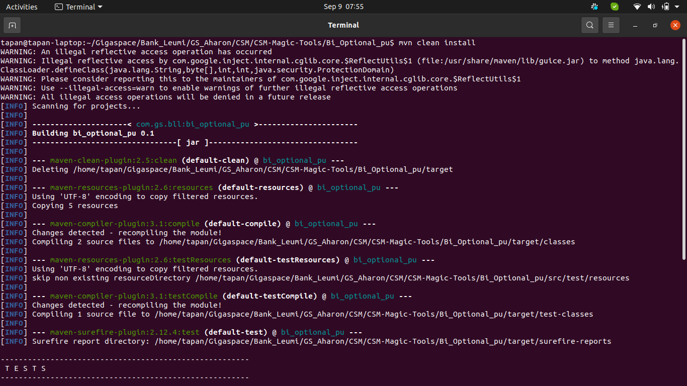

# ODSX Lab-B

## Lab Summary
   
     1. Tiered Storage
        1.1 Build jar (This jar will be deployed as tiered storage)
        1.2 Deploy
        1.3 Update cache policy
        1.4 List
        1.5 Undeploy
        
### 1. Tiered Storage (MENU -> TIEREDSTORAGE)
    
   - Detailed explaination : https://docs.gigaspaces.com/latest/admin/intelligent-tiering-details.html?Highlight=tiered%20storage
    
#### 1.1 Build jar
    
- Build jar : https://github.com/GigaSpaces-ProfessionalServices/CSM-Magic-Tools/tree/master/Bi_Optional_pu  
  - Check out project and build jar

#### 1.2 Deploy
  - Specify source path of this jar at time of Deploy Step
  - It will provide you an option for to create GSC
  - You can specify zone, number of partitions, space property at time of deployment

 - Run odsx -> Go to Tiered Storage
 
 
 - Jar deployment should be successfull. 
 
 - Verify it on broser old UI
 
 - Verify it on browser OPS manager
 - Space deployed as Tiered Storage
 - Default criteria should be visible in configuration
  

#### Start Feeder
 - Go to any manager machine and start feeder to feed data inot objects
 - Or you can deploy feeder as pu by OPS manager or CLI
 
 
 
 - By default it will loaded with default criteria file TieredCriteria.tab
 - Verify the deployment on OPS manager
 
    
 
 #### 1.3 Update Cache Policy
 
  - Modify your criteria / space property required to update from source file
  - Select space which you want to apply udpdate cache policy
  - One can select individual couple partition or all available partitions
    - It will restart backup from couple 
    - Once backup partition restarted it will wait for space to become healthy
 
     
     
     
 
  - This step will demote the selected couple partition
  - After completion of update cache policy Go to OPS manager and see the updated criteria on overview
     
   
   
   
 
   - You can observe after changing the TieredCriteria.tab file based on updated criteria data feeded without downtime of space
 
   
 
 #### 1.4 List
   - Verify it on odsx
   - 
  
 
 #### 1.5 Undeploy
 
 - It will list all available spaces on cluster
 - You can remove / undeploy either one or all available spaces from cluster 
 
     
 