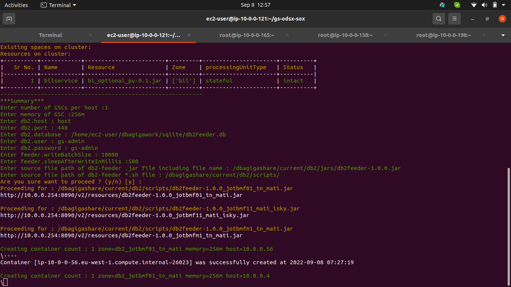
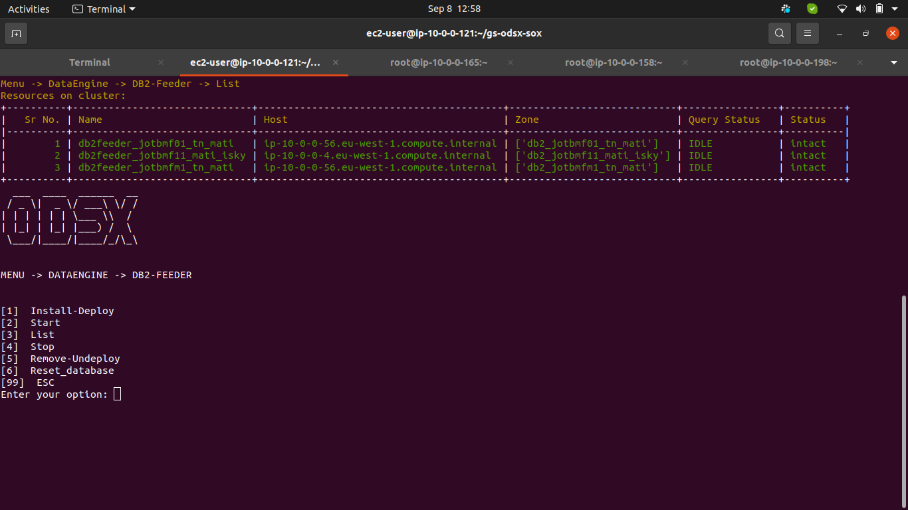
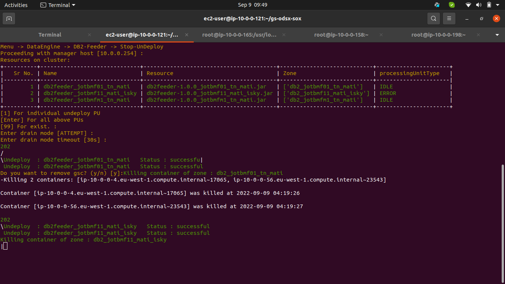
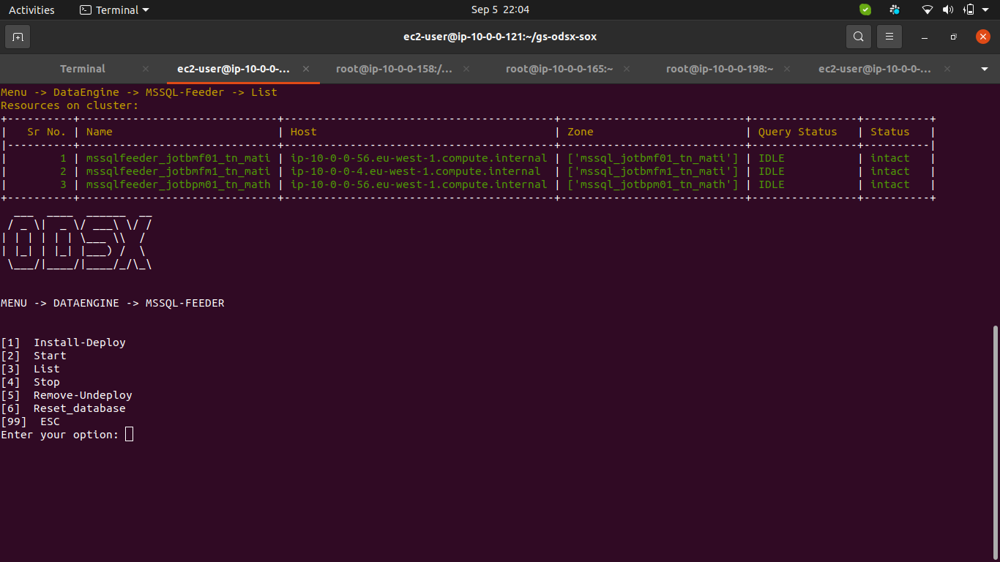
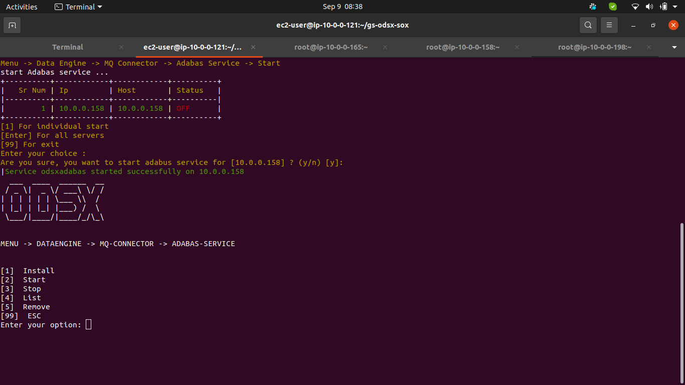
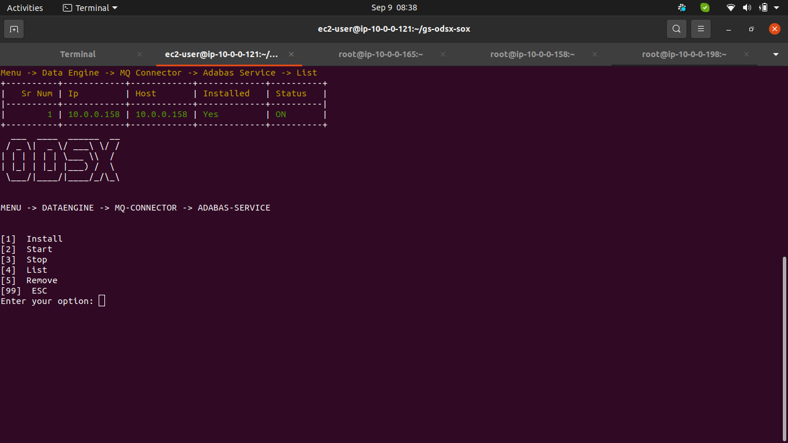
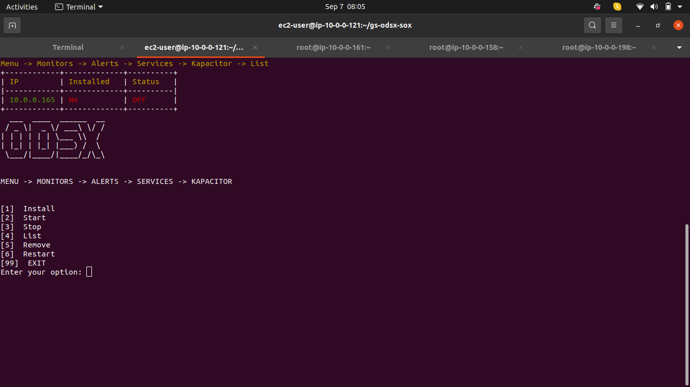
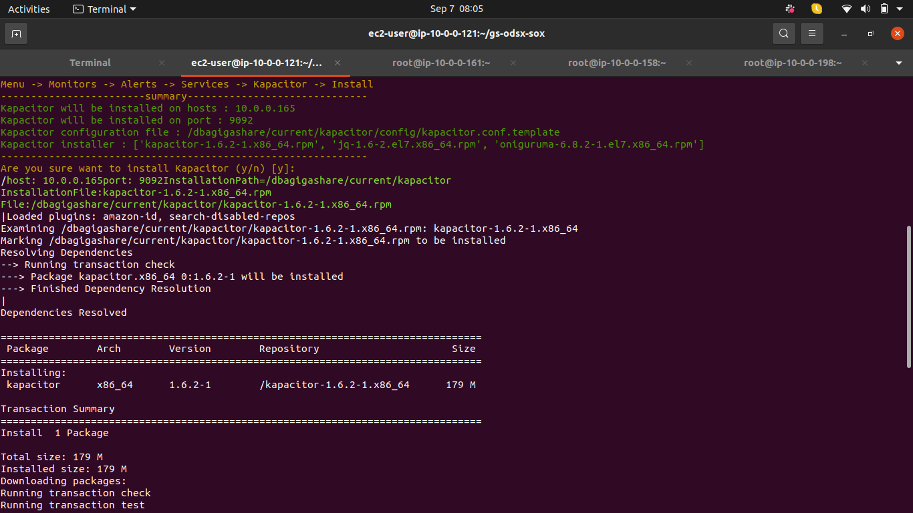
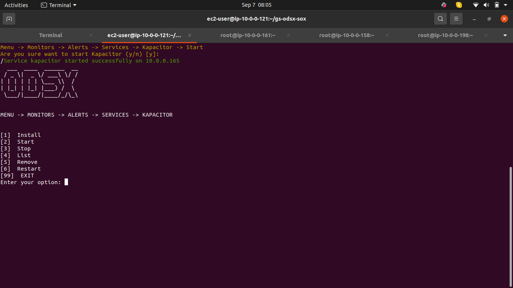

# ODSX Lab-C

## Lab Summary

     1. Data Engine-Feeder
        1.1 DB2-Feeder
            1.1.1 Install-Deploy
            1.1.2 List
            1.1.3 Start
            1.1.4 Stop
            1.1.5 Undeploy
            1.1.6 Reset
        1.2 MSSQL-Feeder
            1.2.1 Install-Deploy
            1.2.2 List
            1.2.3 Start
            1.2.4 Stop
            1.2.5 Undeploy
            1.2.6 Reset
     2. Data Engine-MQ-Connector   
        2.1 Adabas-Service
            2.1.1 Install
            2.1.2 Start
            2.1.3 Stop
            2.1.4 List
            2.1.5 Remove
        2.2 Kafka consumer
            2.2.1 Deploy
            2.2.2 List
            2.2.3 Undeploy
     3. Data Engine-Alerts
        3.1 Kapacitor
            3.1.1 Install
            3.1.2 Start
            3.1.3 Stop
            3.1.4 List
            3.1.5 Remove
            3.1.6 Restart
        3.2 Catalogue
            3.2.1 Add
            3.2.2 Enable
            3.2.3 Diable
            3.2.4 List     
### 1. Data Engine
            
#### 1.1 DB2-Feeder (Menu -> DataEngine -> DB2-Feeder -> Install-Deploy)**
   GIT URL : https://github.com/GigaSpaces-ProfessionalServices/leumi-feeder-from-db2
##### 1.1.1 Install-Deploy
   - For AWS we are using jars of tiered storage which will be deployed as feeder
      (Bcoz MQ setup is not there)
   - Main db2-Feeder jar required under /dbagigashare/current/db2/jars/ 
   - Feeders will be deployed same as mentioned file in /dbagigashare/current/db2/scripts/
        - scripts files which are starting with load_* will be consider as feeder only 
   - GSC container which will create based on script file name + pu deployed based on script file name
   - Entries will be persisted in sqlite3 database as displayed path in summary
   
   
   
   - completion of feeeder deployment
   
   

##### 1.1.2 List
   - Verify feeder status on odsx and UI it should be intact
       
   
   
   

##### 1.1.3 Start
   - This command will start feeder but work in bank or where ever mq connectivity is present
   
##### 1.1.4 Stop   
   - This command will stop feeder but work in bank or where ever mq connectivity is present
    
##### 1.1.5 Reset_database
   - This command will reset the database table entires to avoid port conflict    
##### 1.1.6 Undeploy
   - This will undeploy the deployed feeder and kill the created GSCs
   
   

##### 1.2.1 MSSQL-Feeder (Menu -> DataEngine -> MSSQL-Feeder -> Install-Deploy)**
   GIT URL : https://github.com/GigaSpaces-ProfessionalServices/leumi-feeder-from-db2
##### 1.2.2 Install-Deploy
   - For AWS we are using jars of tiered storage which will be deployed as feeder
      (Bcoz MQ setup is not there)
   - Main Mssql-Feeder jar required under /dbagigashare/current/mssql/jars/ 
   - Feeders will be deployed same as mentioned file in /dbagigashare/current/db2/scripts/
        - scripts files which are starting with load_* will be consider as feeder only 
   - GSC container which will create based on script file name + pu deployed based on script file name
   - Entries will be persisted in sqlite3 database as displayed path in summary
   
   
   
   - completion of feeeder deployment
   
   
   
   

##### 1.2.3 List
   - Verify feeder status on odsx and UI it should be intact
       
   
   
   

##### 1.2.4 Start
   - This command will start feeder but work in bank or where ever mq connectivity is present
   
##### 1.2.5 Stop   
   - This command will stop feeder but work in bank or where ever mq connectivity is present
    
##### 1.2.6 Reset_database
   - This command will reset the database table entires to avoid port conflict    
##### 1.2.7 Undeploy
   - This will undeploy the deployed feeder and kill the created GSCs
   
   
   
      
   
   
### 2. MQ-Connector (Menu -> DataEngine -> MQ-connector)

#### 2.1 Adabas-Service
 
##### 2.1.1 Install-Deploy

   - Keep required service file under : /dbagigashare/current/mq-connector/adabas/jars/
    
   
   
   
   
   
   - Verify by using List
   

##### 2.1.2 Start
   - This command will start adabs service
   
   
   
   
##### 2.1.3 Stop   
   - This command will stop adabs service
   
   
   
    
##### 2.1.4 List
   
   

##### 2.1.5 Remove
      
   
   
  
#### 2.2 Kafka consumer (Menu -> DataEngine -> MQ-connector -> Kafka consumer)**

##### 2.2.1 Deploy

   - Keep required service file under : /dbagigashare/current/mq-connector/adabas/jars/
    
   
   
   
   - verify it by odsx 
   
   
   - verify it by UI
   

##### 2.2.2 List
   
   

##### 2.2.3 Undeploy
      

### 3. Alerts (MENU -> MONITORS -> ALERTS)

#### 3.1 Kapacitor (MENU -> MONITORS -> ALERTS -> SERVICES -> KAPACITOR)

##### 3.1.1 Install
  - It will install kapacitor services on pivot machine  
  - Copy kapacitor template file from <odsx>/config into /dbagigashare/current/kapacitor/config/kapacitor.conf.template
  - Put respected rpms under /dbagigashare/current/kapacitor/
  
  
  
  
  
##### 3.1.2 Start
 - This command will start kapacitor services 
  
  
  

##### 3.1.3 Stop
 - This command will stop kapacitor services 
 - 
##### 3.1.4 List
    
##### 3.1.5 Remove
  - This command will remove kapacitor services
##### 3.1.6 Restart    
  - This command will stop and start kapacitor service    
  
#### 3.2. Alerts-Catalouge  (Menu -> Monitors -> Alerts -> Catalogue )

##### 3.2.1 Add
   - Make user that your tick files must be present under /dbagigashare/current/kapacitor/alerts/    
   
   
   
   
   
    
##### 3.2.2 Enable
   
   
   
   
    

##### 3.2.3 Disable

   
   
   
   
##### 3.2.4 List
    
   
    
